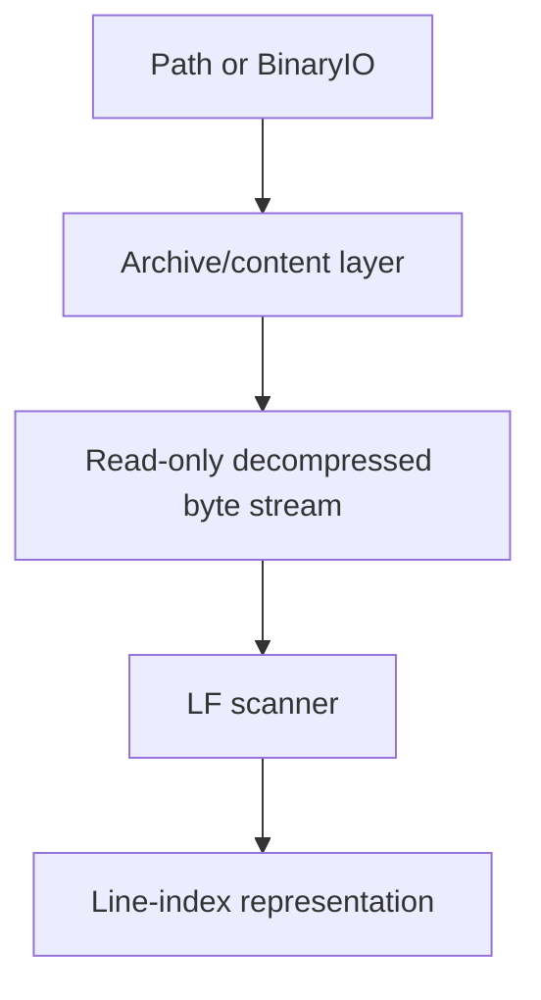
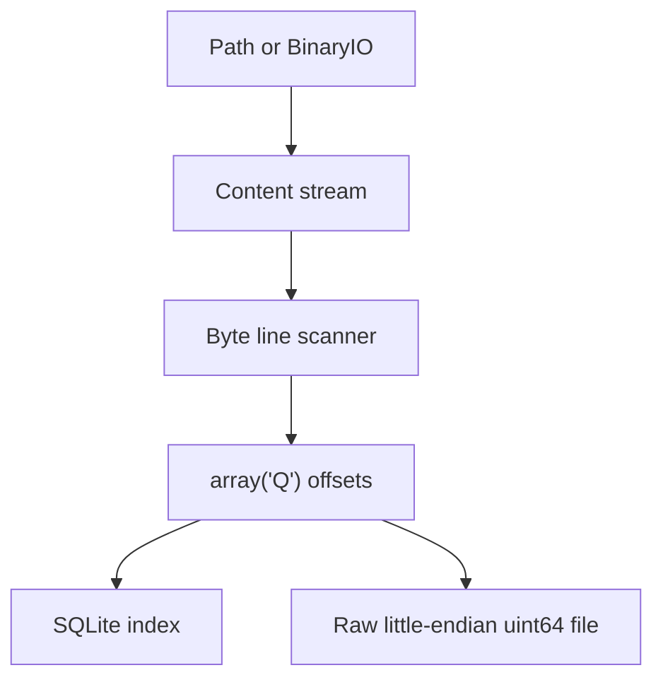

## 📗 Prior Art

> [!NOTE] Prompt
> 
> I have text file, e.g., .jsonl, possibly archived (.7z/.zip/.tar/.tgz/.tbz/plain text). I need a robust mean to scan the actual file (streaming the contents, including decompression streaming, if necessary) and collect info: [(line_byte_offset, line_length)]. I want to be able to skip possible BOM and line includes the first \n char included in length count. The last line may not include \n, if not in the file. Is there a robust lib for this objective?

There is no established library that directly returns `[(line_byte_offset, line_length)]` across all those formats. The robust approach is:

1. Use an archive library to expose the selected member as a stream of decompressed `bytes`.
2. Apply a small binary line-indexing scanner to that stream.

For Python, the best unified archive layer is `libarchive-c`, backed by the mature C `libarchive` library. It supports streaming reads of 7z, ZIP, TAR, gzip/bzip2-compressed TAR, and many other formats. `entry.get_blocks()` yields decompressed blocks without extracting the complete member or loading it into memory. [libarchive](https://www.libarchive.org/) explicitly uses a streaming architecture, and [`libarchive-c`](https://github.com/Changaco/python-libarchive-c#reading-archives) exposes it directly.

### Recommended offset semantics

Use offsets relative to the beginning of the decompressed archive member:

```text
EF BB BF 7B ... 7D 0D 0A
^ BOM    ^ line begins
0        3
```

For this file, the first record would be:

```python
(3, line_length)
```

Thus:

* the UTF-8 BOM occupies offsets `0..2` but is not part of any line;
* `line_byte_offset` points to the actual first byte of the line;
* `line_length` includes the terminating `\n`;
* consequently, `\r\n` contributes two bytes to the length;
* a final unterminated line is still emitted;
* a file ending in `\n` does not produce an additional empty line;
* an empty or BOM-only file has no lines.

These member-relative physical offsets are preferable to renumbering the BOM-stripped stream from zero because they continue to identify the actual bytes in an extracted file.

### Scanner

The scanner should look specifically for byte `0x0A`, using `bytes.find()`. That scan occurs in optimized C code; it is not a Python per-byte loop. Do not use `splitlines()`, because it recognizes additional line boundaries besides `\n`.

A block-stream implementation can look like this:

```python
from collections.abc import Iterable, Iterator

UTF8_BOM = b"\xef\xbb\xbf"


def iter_line_spans(blocks: Iterable[bytes]) -> Iterator[tuple[int, int]]:
    """Yield (offset, length) for LF-delimited lines in a byte stream.

    Offsets are relative to the original decompressed byte stream.
    A leading UTF-8 BOM is skipped. Each terminating LF is included
    in its line's length.
    """
    blocks = iter(blocks)

    # Collect only enough data to decide whether a UTF-8 BOM is present.
    prefix = bytearray()
    remainder = b""

    while len(prefix) < len(UTF8_BOM):
        try:
            block = next(blocks)
        except StopIteration:
            break

        if not block:
            continue

        required = len(UTF8_BOM) - len(prefix)
        prefix.extend(block[:required])
        remainder = block[required:]

        if remainder:
            break

    prefix_bytes = bytes(prefix)
    has_bom = prefix_bytes.startswith(UTF8_BOM)
    bom_length = len(UTF8_BOM) if has_bom else 0

    line_start = bom_length
    stream_end = 0

    def scan_block(block: bytes, block_start: int) -> Iterator[tuple[int, int]]:
        nonlocal line_start, stream_end

        search_from = 0

        while True:
            newline = block.find(b"\n", search_from)
            if newline < 0:
                break

            line_end = block_start + newline + 1
            yield line_start, line_end - line_start
            line_start = line_end
            search_from = newline + 1

        stream_end = block_start + len(block)

    # Scan the bytes used for BOM detection.
    initial_data = prefix_bytes[bom_length:]
    if initial_data:
        yield from scan_block(initial_data, bom_length)
    else:
        stream_end = len(prefix_bytes)

    # Scan unused bytes from the block containing the prefix.
    if remainder:
        yield from scan_block(remainder, len(prefix_bytes))

    # Scan subsequent decompressed blocks.
    for block in blocks:
        if not block:
            continue
        yield from scan_block(block, stream_end)

    # Emit the final line only if bytes remain after the last LF.
    if line_start < stream_end:
        yield line_start, stream_end - line_start
```

Usage with `libarchive-c`:

```python
import libarchive

with libarchive.file_reader("data.7z") as archive:
    regular_entries = [
        entry
        for entry in archive
        if entry.isfile
    ]

    if len(regular_entries) != 1:
        raise ValueError("Archive must contain exactly one regular file")

    spans = list(iter_line_spans(regular_entries[0].get_blocks()))
```

In actual code, validate and process entries during iteration rather than first collecting them, because advancing to another archive entry invalidates the previous entry’s data stream.

For a plain file:

```python
def file_blocks(path, block_size=1024 * 1024):
    with open(path, "rb") as source:
        while block := source.read(block_size):
            yield block


spans = list(iter_line_spans(file_blocks("data.jsonl")))
```

### Practical cautions

* Treat an archive as containing exactly one selected regular file. Do not silently concatenate multiple members; their offsets belong to different byte spaces.
* Detect format by content where possible, not merely by filename suffix. `libarchive` performs format/filter detection.
* Add limits for maximum decompressed size, line count, and optionally maximum line length when inputs are untrusted.
* For millions of lines, a Python `list[tuple[int, int]]` consumes substantial memory. Packed 64-bit pairs, two `array("Q")` arrays, a memory-mapped index, or fixed-width records written incrementally will be much smaller.
* These offsets index the decompressed member. They do not make `.7z`, `.tgz`, or `.tbz` randomly seekable. To revisit arbitrary lines efficiently, retain an extracted file/cache or build a compression-format-specific seek index.

---
---

## 📗 Naming

> [!NOTE] Prompt
> 
> What would I call it? Archive Line Map?

“Archive Line Index” is clearer than “Archive Line Map.” It communicates that the result supports locating lines by byte position.

Suggested terminology:

* Feature/concept: **archive line index**
* Python type: `LineIndex`
* Individual record: `LineSpan`
* Record fields: `byte_offset`, `byte_length`
* Streaming function: `iter_line_spans()`
* Collection function: `build_line_index()`

```python
@dataclass(frozen=True, slots=True)
class LineSpan:
    byte_offset: int
    byte_length: int
```

If the distinction matters, describe it as a **decompressed-member line index**, because the offsets address the member’s decompressed byte stream, not the archive file itself.

“Line map” is understandable, but “index” better conveys ordered positional metadata and potential lookup use.

---
---

## 📗 Architecture

### 📗 Architecture

> [!NOTE] Prompt
> 
> Help me define architecure of the project starting from a high level. I want the package to provide two features:
> 
> 1. a BinaryIO read-only sequential byte stream over the text file (including decompression)
> 2. actual archive line index functionality (which will use the stream in Point 1)    
> 
> The stream in Point 1 is necessary for line indexing, but it will also be used outside the package as a standalone feature.
> 
> When implementing archive handling, I want to use the attached SPEC as a ref (specifically for archive handling).

The clean architecture is a two-feature package with one-way dependency:



The archive layer knows nothing about lines. The indexing layer knows nothing about ZIP, TAR, 7z, or decompression—it consumes an ordinary binary stream.

#### 1. Feature A: decompressed content stream

This feature exposes the bytes of:

* a plain file; or
* the single regular-file member of a supported archive.

Conceptually:

```python
def open_content_stream(
    source: Source,
    *,
    max_uncompressed_size: int | None = None,
) -> ContentStream:
    """Open the plain file or sole archive member as a binary stream."""
```

`ContentStream` should be a proper context-managed, read-only binary I/O object:

```python
class ContentStream(io.BufferedIOBase):
    def readable(self) -> bool: ...
    def writable(self) -> bool: ...  # False
    def seekable(self) -> bool: ...  # False
    def read(self, size: int = -1) -> bytes: ...
    def readinto(self, buffer: Buffer) -> int: ...
    def close(self) -> None: ...
```

I would describe it as implementing the readable portion of `BinaryIO`, rather than promising an unrestricted `BinaryIO`. In particular:

* it is sequential;
* it is not writable;
* it is not seekable;
* reads return decompressed bytes;
* the byte position is relative to the decompressed member;
* closing it releases all archive/decompression resources;
* closing it does not close a caller-owned source stream.

`read(-1)` should retain normal Python semantics and return all remaining bytes. That can consume arbitrary memory, but only because the caller explicitly requested it; ordinary bounded reads remain streaming.

##### The stream must preserve all content bytes

The stream should not:

* decode text;
* remove a BOM;
* recognize line endings;
* normalize newlines;
* parse JSONL.

If the decompressed file begins with `EF BB BF`, the stream returns those three bytes. BOM handling belongs to the line-index layer because Feature A is also a standalone byte-stream API.

#### 2. Internal archive/content layer

The archive behavior should largely follow the attached [SPEC.md](sandbox:/workspace/scratch/2f3398ece6d4/upload/SPEC.md).

Carry forward these policies:

* support plain files, 7z, ZIP, TAR, and supported compressed TAR variants;
* prefer content-based detection;
* reject a recognized archive suffix containing invalid archive data;
* require exactly one regular-file member;
* reject links and other special entries;
* do not silently ignore metadata files;
* reject encrypted archives clearly;
* never extract to the filesystem;
* enforce `max_uncompressed_size` using both metadata and actual byte count;
* preserve terminal CRC/decompression errors;
* distinguish package-owned and caller-owned source lifetimes;
* provide deterministic cancellation and cleanup.

Do not carry forward these parts of the old design:

* incremental text decoding;
* `utf-8-sig`;
* CR/LF logical-line splitting;
* line batching;
* `skip_lines`;
* the requirement to run every backend through the same extraction thread.

Those belong to the old decoded-line API, not the new byte-stream abstraction.

##### Backend boundary

Use a small internal reader interface:

```python
class RawContentReader(Protocol):
    def readinto(self, buffer: Buffer) -> int: ...
    def close(self) -> None: ...
```

Implementations:

* `PlainReader`
* `ZipMemberReader`
* `TarMemberReader`
* `SevenZipMemberReader`

The public `ContentStream` wraps whichever reader the detector selects and adds:

* buffering;
* uncompressed-byte counting;
* size-limit enforcement;
* unified error translation;
* metadata;
* deterministic closing.

##### 7z is the exceptional backend

Plain files, ZIP members, and TAR members naturally provide pull-based `read()` operations.

`py7zr` extraction is callback/push-oriented. Its adapter therefore needs:

```text
py7zr extraction thread
        ↓ decompressed byte blocks
bounded byte queue
        ↓
SevenZipMemberReader.readinto()
```

The queue must be bounded by bytes or by a small fixed number of bounded blocks. Early stream closure signals cancellation, unblocks both sides, closes resources, and joins the extraction thread.

There is no need to impose this thread-and-queue arrangement on naturally pull-based backends. The commonality should be at the reader interface, not necessarily in their internal mechanics.

#### 3. Stream metadata

The stream should expose immutable descriptive metadata without mixing it into its byte API:

```python
@dataclass(frozen=True, slots=True)
class ContentInfo:
    format: Literal["plain", "7z", "zip", "tar"]
    member_name: str | None
    declared_size: int | None
```

Potentially:

```python
stream.info
stream.bytes_read
```

For a plain file, `member_name` can be `None` or the source filename, depending on the final metadata contract.

#### 4. Feature B: line scanning

Make the fundamental scanner generic over any binary stream:

```python
def iter_line_spans(
    stream: BinaryIO,
    *,
    skip_utf8_bom: bool = True,
    buffer_size: int = DEFAULT_BUFFER_SIZE,
) -> Iterator[LineSpan]:
    ...
```

```python
@dataclass(frozen=True, slots=True)
class LineSpan:
    byte_offset: int
    byte_length: int
```

Then provide the archive-aware convenience operation:

```python
def build_line_index(
    source: Source,
    *,
    skip_utf8_bom: bool = True,
    max_uncompressed_size: int | None = None,
) -> LineIndex:
    with open_content_stream(
        source,
        max_uncompressed_size=max_uncompressed_size,
    ) as stream:
        return LineIndex.from_spans(iter_line_spans(stream))
```

This division is important:

* `iter_line_spans()` can index any caller-provided binary stream.
* `build_line_index()` is the integration of Features A and B.
* Archive testing and scanner testing remain independent.

#### 5. Line semantics

The index should operate on bytes, not decoded Unicode text.

Recommended contract:

* line separator is byte `0x0A`;
* the terminating `0x0A` is included in `byte_length`;
* a preceding `0x0D` is simply part of the line, so CRLF contributes two bytes;
* a lone `0x0D` does not terminate a line;
* an unterminated final line is included;
* a stream ending in `0x0A` does not create an additional empty line;
* an empty or BOM-only stream has no lines;
* offsets address the original decompressed bytes.

With a UTF-8 BOM:

```text
EF BB BF 7B ... 7D 0A
0        3
```

The first span starts at offset `3`. The stream itself still exposes bytes `0..2`; only the scanner excludes them.

This should explicitly be called an UTF-8 BOM policy. Automatically skipping UTF-16 or UTF-32 BOMs would be misleading because scanning for a single `0x0A` byte is not a valid general Unicode-line algorithm for those encodings.

Use `bytes.find(b"\n")` over bounded chunks. That performs the scan in optimized native code and handles lines spanning arbitrary chunk boundaries without a Python per-byte loop.

#### 6. Index representation

Separate index construction from index storage:

```text
BinaryIO → iterator of LineSpan → LineIndexBuilder → LineIndex
```

That lets you later choose among:

* an in-memory collection for small inputs;
* packed 64-bit records;
* a memory-mapped index file;
* a persistent index written incrementally.

Do not initially define `LineIndex` as merely `list[tuple[int, int]]`. Python object overhead becomes enormous for large JSONL dumps.

The public logical record may remain `(offset, length)` even if the physical representation stores only line-start offsets plus total decompressed size. The latter can derive lengths and roughly halves fixed-width storage.

For a persistent index, useful header metadata would include:

* format version;
* line count;
* decompressed byte size;
* skipped BOM length;
* span encoding;
* optional source identity or content digest.

#### 7. Completion and validity

Successful index creation must mean that the content stream was read to its real terminal EOF and all available archive integrity checks completed.

Therefore:

* never publish a supposedly complete index after decompression failure;
* persistent construction should write a temporary index and finalize it only after successful stream exhaustion;
* earlier decompressed bytes may have been delivered before a late CRC error, but the builder must discard or mark the partial index;
* closing a standalone stream early does not establish archive integrity.

This follows the integrity model from the reference SPEC and becomes especially important when the index is reused later.

#### 8. Important limitation

The offsets belong to the decompressed member’s byte space. They do not make the compressed archive randomly seekable.

A `LineIndex` can tell you:

```text
line 42 → decompressed offset 15327, length 418
```

But retrieving that line from a `.7z`, `.tgz`, or many other compressed streams may still require decompression from the beginning.

Random line retrieval requires a separate strategy, such as:

* retaining a decompressed file;
* retaining decompressed chunks;
* building format-specific decompression checkpoints;
* creating an indexed seekable compressed representation.

That capability should not be silently implied by the initial `LineIndex` API.

#### 9. Suggested package boundaries

At a high level:

```text
src/archive_line_index/
    stream/          # Public content-stream feature
    archives/        # Detection, validation, backend readers
    indexing/        # LF scanning and index construction
    storage/         # In-memory or persistent index representations
    errors.py
    models.py
    api.py
```

The dependency direction should remain:

```text
archives → stream
stream   ← indexing
indexing → storage
api      → composition of all layers
```

More precisely, `indexing` depends only on a readable binary stream protocol, not on `archives`. The top-level API composes them.

The next architectural decision should be whether the first version produces only an in-memory index or defines a persistent, memory-mappable index format from the outset. For realistically large Wiktionary data, I would design around an incrementally written persistent index, while retaining `iter_line_spans()` as the simple low-level API.

---
---

### 📗 Packed Index Format

> [!NOTE] Prompt
> 
> Tell me more about
> ```
> For millions of lines, a Python list[tuple[int, int]] consumes substantial memory. Packed 64-bit pairs, two array("Q") arrays, a memory-mapped index, or fixed-width records written incrementally will be much smaller.
> ```

The core issue is Python object overhead. The two integers contain only 16 bytes of useful numeric data, but representing them as a tuple inside a list can require roughly 90–125 bytes per line on 64-bit CPython.

#### Approximate memory cost

For:

```python
spans = [
    (offset, length),
    ...
]
```

each record can involve:

* 8 bytes: pointer in the list;
* 56 bytes: two-element tuple;
* approximately 28 bytes: `offset` integer;
* approximately 28 bytes: `length` integer.

That is about 120 bytes per line, excluding list over-allocation and allocator overhead. Small repeated lengths may reuse cached integer objects, so the real number can sometimes be lower, but offsets will normally be unique integers.

|  Line count | Python list of pairs | Packed 64-bit pairs | One cumulative 64-bit offset |
| ----------: | -------------------: | ------------------: | ---------------------------: |
|   1 million |           ~90–120 MB |               16 MB |                         8 MB |
|  10 million |          ~0.9–1.2 GB |              160 MB |                        80 MB |
| 100 million |             ~9–12 GB |              1.6 GB |                       800 MB |

The difference is that packed representations store the numeric bits directly, without a tuple and two heap-allocated Python objects for every line.

#### 1. Packed `(offset, length)` pairs

Each record consists of two unsigned 64-bit integers:

```text
offset: 8 bytes
length: 8 bytes
total: 16 bytes
```

Conceptually:

```python
struct.Struct("<QQ")
```

A record might be serialized with:

```python
record = struct.pack("<QQ", offset, length)
```

Advantages:

* simple representation;
* direct correspondence to `LineSpan`;
* supports extremely large files and lines;
* constant-width records permit direct lookup:

```python
record_position = header_size + line_number * 16
```

Disadvantages:

* stores more information than necessary;
* 160 MB for 10 million lines;
* building one large `bytes` or `bytearray` object still keeps the full index in memory.

This is a good straightforward format, but not the most compact format for your semantics.

#### 2. Two `array("Q")` arrays

Python’s `array` module stores unboxed C values:

```python
from array import array

offsets = array("Q")
lengths = array("Q")

offsets.append(offset)
lengths.append(length)
```

Each array uses approximately eight bytes per element, giving the same 16 bytes per line as packed pairs.

Advantages:

* part of the standard library;
* appendable;
* far smaller than Python tuples;
* values are convenient to access from Python;
* offset and length data can be processed separately.

Disadvantages:

* the complete index remains in RAM;
* array indexing creates a Python `int` for the returned value;
* the raw serialized representation is native-endian unless explicitly normalized;
* `"Q"` should not by itself be treated as a portable file-format specification.

Two arrays are mostly useful when the index is temporary and the total 16-bytes-per-line memory cost is acceptable.

An interleaved array is also possible:

```python
records = array("Q")

records.extend((offset, length))
```

Then:

```python
offset = records[line_number * 2]
length = records[line_number * 2 + 1]
```

It has the same memory cost but is less expressive than separate arrays.

#### 3. Store only cumulative line-end offsets

For this project, storing both values is unnecessary.

Suppose the index contains the exclusive end offset of every line:

```text
line 0 ends at byte 125
line 1 ends at byte 294
line 2 ends at byte 431
```

The span of line `i` is:

```python
end = ends[i]
start = bom_length if i == 0 else ends[i - 1]
length = end - start
```

Thus one 64-bit value per line gives both the offset and length:

```python
def span(line_number: int) -> LineSpan:
    end = ends[line_number]
    start = bom_length if line_number == 0 else ends[line_number - 1]
    return LineSpan(
        byte_offset=start,
        byte_length=end - start,
    )
```

This works for:

* LF-terminated lines;
* CRLF lines;
* empty lines;
* a final unterminated line;
* files with an excluded initial UTF-8 BOM.

For example:

```text
decompressed bytes:

EF BB BF 61 62 0A 63 64
          └ line 0 ┘ └ line 1

BOM length: 3
line ends: [6, 8]
```

The derived spans are:

```text
line 0: offset 3, length 3
line 1: offset 6, length 2
```

This reduces storage to eight bytes per line:

* 10 million lines: 80 MB;
* 100 million lines: 800 MB.

You could equivalently store line-start offsets plus the total decompressed size. Line ends are arguably more natural during scanning because every discovered LF immediately supplies the exclusive end offset.

##### Building an end-offset index

The scanner maintains:

```python
absolute_position = 0
```

For every LF at local block position `newline`:

```python
line_end = block_start + newline + 1
```

It appends `line_end`. At EOF, it appends the total decompressed size only if bytes remain after the previous line end.

The public API can still return `LineSpan`. The physical storage format does not have to match the public logical representation.

#### 4. Fixed-width records written incrementally

Instead of accumulating values in an array, write each value directly to an index file:

```python
end_record = struct.Struct("<Q")

for line_end in iter_line_ends(stream):
    index_file.write(end_record.pack(line_end))
```

Memory use then remains essentially constant regardless of line count:

```text
decompression buffers
+ scanner buffer
+ output buffering
+ small builder state
```

The index itself grows on disk at eight bytes per line.

Advantages:

* works for indexes larger than available memory;
* construction remains bounded-memory;
* fixed-width records support direct random lookup;
* index survives process termination and can be reused;
* no third-party dependency is needed.

Disadvantages:

* each lookup normally involves file I/O unless buffered or memory-mapped;
* the file needs a defined header and byte order;
* incomplete construction must be handled safely.

Writes should be buffered. Do not issue a physical disk write for every individual eight-byte value; either use a buffered file or accumulate a moderate block of records before writing it.

#### 5. Memory-mapped index

Memory mapping is an access strategy for the persistent fixed-width file. It is not a separate index encoding.

```python
with open(index_path, "rb") as file:
    mapping = mmap.mmap(file.fileno(), 0, access=mmap.ACCESS_READ)
```

A requested value can then be decoded directly:

```python
end = struct.unpack_from(
    "<Q",
    mapping,
    records_offset + line_number * 8,
)[0]
```

The operating system loads only the required pages into physical memory. A 10 GB index can therefore be mapped without reading the entire 10 GB into RAM.

Advantages:

* direct O(1) line-number lookup;
* operating-system page cache handles caching;
* multiple processes can map the same index;
* the Python heap does not contain millions of objects;
* iteration through adjacent records is efficient.

Important nuance: the process’s virtual address space includes the entire mapping, but physical RAM is consumed only for resident pages. On 64-bit systems this is normally desirable and unproblematic.

The memory map should generally be read-only after index construction.

#### Recommended representation

For Archive Line Index, I would use this division:

```text
Public logical representation:
    LineSpan(byte_offset, byte_length)

Persistent physical representation:
    one uint64 exclusive-end offset per line
```

The public interface could provide:

```python
class LineIndex:
    def __len__(self) -> int: ...

    def span(self, line_number: int) -> LineSpan: ...

    def __getitem__(self, line_number: int) -> LineSpan: ...

    def iter_spans(self) -> Iterator[LineSpan]: ...
```

Internally:

```python
def span(self, line_number: int) -> LineSpan:
    end = self._read_end(line_number)

    if line_number == 0:
        start = self.bom_length
    else:
        start = self._read_end(line_number - 1)

    return LineSpan(start, end - start)
```

This gives callers the intuitive pair representation without physically storing redundant pairs.

#### Suggested persistent-file structure

A simple format could be:

```text
Header
    magic identifier
    format version
    flags
    BOM length
    line count
    decompressed content size
    optional content digest

Records
    uint64 little-endian exclusive line ends
```

For example:

```text
offset  size  meaning
0       8     magic
8       4     format version
12      4     flags
16      8     BOM length
24      8     line count
32      8     decompressed size
40      ...   optional identity information
N       8×L   line-end records
```

The exact header layout can wait until the index lifecycle and source-validation policy are defined.

#### Safe construction

A persistent index should be built transactionally:

1. Create a temporary file next to the intended index.
2. Write a placeholder header.
3. Stream the decompressed content.
4. Write line-end records incrementally.
5. Finish decompression and archive integrity validation.
6. Update the header with the final line count and content size.
7. Flush and close the file.
8. Atomically replace the destination index.

If decompression, CRC checking, or scanning fails, the temporary file is discarded. A partially built index is never mistaken for a complete one.

#### More compressed alternatives

Line lengths in JSONL are often much smaller than 64-bit offsets. You could store variable-length encoded lengths instead of absolute ends. That may reduce storage substantially—perhaps to one to three bytes for many lines—but it sacrifices simple O(1) lookup.

Random lookup would then require periodic checkpoints:

```text
checkpoint absolute offset every 1,024 lines
+
variable-length line lengths within each checkpoint block
```

This is useful if index size becomes a real constraint, but it introduces:

* variable-length encoding;
* checkpoint tables;
* more complicated lookup;
* more error-validation logic;
* slower individual access.

I would begin with memory-mapped `uint64` exclusive-end offsets. At eight bytes per line, it is compact, deterministic, portable, and simple enough to validate thoroughly.

---
---

### 📗 Python Array

> [!NOTE] Prompt
> 
> Give me concise Python’s `array` overview.

Python’s [`array`](https://docs.python.org/3/library/array.html) module provides mutable, compact arrays of primitive numeric values.

```python
from array import array

offsets = array("Q")  # unsigned long long
offsets.append(123)
offsets.extend([456, 789])

print(offsets[1])     # 456
print(len(offsets))   # 3
```

Unlike a `list[int]`, values are stored directly as fixed-width C numbers rather than pointers to Python integer objects.

Common type codes:

| Code  | C type             |     Typical size |
| ----- | ------------------ | ---------------: |
| `"B"` | unsigned char      |           1 byte |
| `"I"` | unsigned int       | commonly 4 bytes |
| `"Q"` | unsigned long long | commonly 8 bytes |
| `"f"` | float              |          4 bytes |
| `"d"` | double             |          8 bytes |

Confirm the actual element width with:

```python
offsets.itemsize  # normally 8 for "Q"
```

Useful operations:

```python
offsets.append(value)
offsets.extend(values)
offsets[10]
offsets[10:20]
offsets.pop()
offsets.reverse()

offsets.tofile(file)
offsets.fromfile(file, count)

raw = offsets.tobytes()
offsets.frombytes(raw)
```

For line spans:

```python
ends = array("Q")

# One cumulative exclusive-end offset per line.
ends.append(125)
ends.append(294)

end = ends[i]
start = bom_length if i == 0 else ends[i - 1]
length = end - start
```

Important limitations:

* the complete array remains in memory;
* accessing an element creates a Python `int`;
* storage uses the machine’s native byte order;
* type widths should be checked rather than assumed for a portable file format;
* `array` is not memory-mapped.

For an in-memory index, `array("Q")` is a good standard-library choice. For a persistent large index, fixed little-endian records plus `mmap` provide a more explicit and portable format.

---
---

### 📗 Index Format

> [!NOTE] Prompt
> 
> I will use just the offset, no length in the index. The index will use `array("Q")` in memory format and be persisted in an SQLite database next to archive.

That simplifies the design considerably. I recommend storing line-start offsets plus one final EOF sentinel:

```python
array("Q", [
    first_line_start,
    second_line_start,
    ...,
    last_line_start,
    decompressed_size,   # sentinel
])
```

Then:

```python
line_count = len(offsets) - 1
start = offsets[line_number]
end = offsets[line_number + 1]
length = end - start
```

The sentinel is still only an offset—not a stored length—and makes the last line behave identically to every other line.

Examples:

```python
# b"abc\ndef"
array("Q", [0, 4, 7])

# b"\xef\xbb\xbfabc\n"
array("Q", [3, 7])

# Empty file
array("Q", [0])

# BOM-only file
array("Q", [3])
```

For SQLite, avoid one row per line. Millions of SQLite rows would add substantial storage and insertion overhead. Persist the array as a BLOB:

```sql
CREATE TABLE line_index (
    id                    INTEGER PRIMARY KEY CHECK (id = 1),
    format_version        INTEGER NOT NULL,
    line_count            INTEGER NOT NULL,
    decompressed_size     INTEGER NOT NULL,
    bom_length            INTEGER NOT NULL,
    archive_size          INTEGER NOT NULL,
    archive_mtime_ns      INTEGER NOT NULL,
    member_name           TEXT,
    offsets               BLOB NOT NULL
);
```

Basic serialization:

```python
offset_blob = offsets.tobytes()
connection.execute(
    """
    INSERT INTO line_index (
        id,
        format_version,
        line_count,
        decompressed_size,
        bom_length,
        archive_size,
        archive_mtime_ns,
        member_name,
        offsets
    )
    VALUES (1, ?, ?, ?, ?, ?, ?, ?, ?)
    """,
    (
        1,
        len(offsets) - 1,
        decompressed_size,
        bom_length,
        archive_size,
        archive_mtime_ns,
        member_name,
        offset_blob,
    ),
)
```

And loading:

```python
offsets = array("Q")
offsets.frombytes(row["offsets"])
```

Two cautions:

* `array("Q").tobytes()` uses native byte order. Define the database format as little-endian 64-bit and use `byteswap()` when running on a big-endian machine.
* SQLite/Python may temporarily copy a large BLOB during insertion and loading. If indexes might approach hundreds of megabytes, store fixed-size BLOB chunks—perhaps 8–32 MiB each—rather than one enormous BLOB.

A scalable chunk table would be:

```sql
CREATE TABLE offset_chunks (
    chunk_number  INTEGER PRIMARY KEY,
    first_line    INTEGER NOT NULL,
    offset_count  INTEGER NOT NULL,
    offsets       BLOB NOT NULL
);
```

Given that the working representation is already one in-memory `array("Q")`, a single BLOB is the simplest initial implementation. Chunked BLOBs become worthwhile if index sizes approach SQLite’s BLOB limit or temporary copies cause excessive peak memory.

---
---

### 📗 Binary Format

> [!NOTE] Prompt
> 
> SQLite will use
> ```sql
> CREATE TABLE line_index (
>     offset               INTEGER PRIMARY KEY
> );
> ```
> but I need a second binary format for binary access. MATLAB? or what?

You likely mean `mmap`. Yes: use a flat fixed-width binary file containing consecutive little-endian 64-bit offsets, then memory-map it for fast indexed access.

`mmap` is the access mechanism, not the file format.

#### Recommended companion format

```text
offset 0: uint64 little-endian
offset 1: uint64 little-endian
offset 2: uint64 little-endian
...
```

Record `i` is located at:

```python
byte_position = i * 8
```

Write it from `array("Q")`:

```python
import sys
from array import array

def write_offsets(path, offsets: array) -> None:
    stored = array("Q", offsets)

    if stored.itemsize != 8:
        raise RuntimeError("'Q' is not 64 bits")

    if sys.byteorder != "little":
        stored.byteswap()

    with open(path, "wb") as file:
        stored.tofile(file)
```

Load the complete array:

```python
import sys
from array import array

def read_offsets(path) -> array:
    offsets = array("Q")

    with open(path, "rb") as file:
        offsets.fromfile(file, file.seek(0, 2) // 8)

    if sys.byteorder != "little":
        offsets.byteswap()

    return offsets
```

For zero-copy random access, use `mmap`:

```python
import mmap
import struct

_UINT64 = struct.Struct("<Q")

file = open("archive.line-offsets", "rb")
mapping = mmap.mmap(file.fileno(), 0, access=mmap.ACCESS_READ)

def get_offset(line_number: int) -> int:
    return _UINT64.unpack_from(mapping, line_number * 8)[0]
```

Cleanup:

```python
mapping.close()
file.close()
```

If you store an EOF sentinel, then:

```python
start = get_offset(line_number)
end = get_offset(line_number + 1)
```

#### SQLite consideration

With:

```sql
CREATE TABLE line_index (
    offset INTEGER PRIMARY KEY
);
```

SQLite orders and indexes offsets, but it does not efficiently map a line number to an offset. A query such as:

```sql
SELECT offset
FROM line_index
ORDER BY offset
LIMIT 1 OFFSET ?;
```

becomes increasingly expensive for high line numbers.

That is fine if:

* SQLite is the canonical/queryable representation;
* the binary file supplies indexed line-number access;
* the binary file is regenerated from:

```sql
SELECT offset FROM line_index ORDER BY offset;
```

Treat the binary file as a derived cache. Then SQLite and the binary file need not be transactionally updated together: commit SQLite first and atomically replace the regenerated binary file.

A suitable naming scheme would be:

```text
archive.jsonl.7z
archive.jsonl.7z.line-index.sqlite3
archive.jsonl.7z.line-offsets.u64
```

A MATLAB `.mat` file would add unnecessary format complexity and dependency. A raw little-endian `uint64` file plus `mmap` is simpler and directly compatible with Python, NumPy, C, Rust, and other languages.

---
---

### 📗 mmap

> [!NOTE] Prompt
> 
> Yes to EOF sentinel. mmap?

Yes—`mmap` is appropriate for accessing the companion binary index.

A memory map exposes a file as a byte-addressable memory region without first loading the complete file into a Python object. The OS loads needed pages on demand.

Your binary index contains `N + 1` little-endian `uint64` values:

```text
[line 0 offset]
[line 1 offset]
...
[line N-1 offset]
[EOF sentinel]
```

Thus:

```python
start = offsets[line_number]
end = offsets[line_number + 1]
length = end - start
```

Standard-library implementation:

```python
import mmap
import struct
from pathlib import Path

_UINT64 = struct.Struct("<Q")


class MappedLineIndex:
    def __init__(self, path: str | Path) -> None:
        self._file = open(path, "rb")

        size = self._file.seek(0, 2)

        if size < 8 or size % 8:
            self._file.close()
            raise ValueError("Invalid line-index file size")

        self._mapping = mmap.mmap(
            self._file.fileno(),
            0,
            access=mmap.ACCESS_READ,
        )

    def __len__(self) -> int:
        # One stored offset is the EOF sentinel.
        return len(self._mapping) // 8 - 1

    def offset(self, line_number: int) -> int:
        if not 0 <= line_number < len(self):
            raise IndexError("line number out of range")

        return _UINT64.unpack_from(
            self._mapping,
            line_number * 8,
        )[0]

    def span(self, line_number: int) -> tuple[int, int]:
        if not 0 <= line_number < len(self):
            raise IndexError("line number out of range")

        start = _UINT64.unpack_from(
            self._mapping,
            line_number * 8,
        )[0]

        end = _UINT64.unpack_from(
            self._mapping,
            (line_number + 1) * 8,
        )[0]

        return start, end - start

    def close(self) -> None:
        self._mapping.close()
        self._file.close()

    def __enter__(self):
        return self

    def __exit__(self, exc_type, exc_value, traceback) -> None:
        self.close()
```

Usage:

```python
with MappedLineIndex("dump.line-offsets.u64") as index:
    offset, length = index.span(500_000)
```

The benefits are:

* O(1) lookup by line number;
* no Python object per offset;
* no need to load the entire index;
* multiple processes can map the same read-only file;
* sequential access benefits from OS read-ahead;
* random access uses the OS page cache.

The binary format itself remains a flat little-endian `uint64` array. `mmap` is merely the efficient way to access it.

On Windows, close all mappings before replacing or deleting the binary index file. A mapped file commonly cannot be replaced while the mapping remains active.

---
---

### 📗 mmap

> [!NOTE] Prompt
> 
> Raw little-endian `uint64` is OK. For now, mmap is out of scope. Do we have a complete architecture (not implementation details, but key algos, data structures, etc.)?

We have the core architecture, but it was not fully closed until defining index invariants, metadata, persistence authority, and failure semantics. With the defaults below, it is architecturally complete enough to write a specification and implementation plan.

#### 1. System boundaries



There are two public features:

1. A sequential, read-only binary stream over the plain file or sole archive member.
2. A line-index builder consuming that stream.

The indexing layer depends only on a readable binary stream. It has no knowledge of archives or decompression.

#### 2. Content-stream layer

##### Contract

The stream:

* returns the original decompressed bytes;
* includes any BOM;
* performs no decoding;
* performs no newline normalization;
* is readable and non-seekable;
* supports deterministic closing;
* counts actual decompressed bytes;
* enforces an optional maximum decompressed size;
* exposes archive/member metadata separately from its byte interface.

##### Inputs

```python
Source = str | PathLike[str] | BinaryIO
```

Ownership:

* paths are opened and closed by the package;
* caller-provided streams remain caller-owned;
* processing starts at the stream’s current position;
* the original position is not restored.

##### Archive policy

Inherited from the reference SPEC:

* plain, ZIP, TAR variants, and 7z;
* content-first detection;
* recognized but invalid archive suffixes fail;
* exactly one regular-file member;
* directories do not count;
* links and other special entries cause rejection;
* no filesystem extraction;
* no encrypted archives or password interface;
* terminal CRC/decompression errors remain observable.

##### Backends

* Plain, ZIP, and TAR use pull-based readers.
* 7z adapts `py7zr`’s push-based extraction using one extraction thread and a bounded byte queue.
* A common wrapper supplies buffering, byte counting, size-limit enforcement, error translation, and cleanup.

Successful EOF means all available archive integrity checks completed. Early closure does not prove archive integrity.

#### 3. Index semantics

Offsets address the original decompressed member byte space.

The scanner:

* optionally recognizes and excludes only an initial UTF-8 BOM;
* treats byte `0x0A` as the sole line terminator;
* includes the LF, and any preceding CR, in the line’s byte range;
* treats a lone CR as ordinary data;
* includes a final unterminated line;
* does not create an empty line after a terminal LF;
* uses `bytes.find(b"\n")`, not a Python per-byte loop.

No text decoding is involved.

#### 4. Offset-array invariant

For `N` lines, the array contains exactly `N + 1` offsets:

```text
offsets[0]     start of line 0
offsets[1]     start of line 1
...
offsets[N - 1] start of line N - 1
offsets[N]     decompressed EOF sentinel
```

Therefore:

```python
line_count = len(offsets) - 1

start = offsets[line_number]
end = offsets[line_number + 1]
length = end - start
```

The offsets are strictly increasing except that an index with no lines consists only of the EOF sentinel.

Examples:

| Content          | Offset array |
| ---------------- | ------------ |
| `b""`            | `[0]`        |
| UTF-8 BOM only   | `[3]`        |
| `b"abc"`         | `[0, 3]`     |
| `b"abc\n"`       | `[0, 4]`     |
| `b"\n"`          | `[0, 1]`     |
| `b"\n\n"`        | `[0, 1, 2]`  |
| `BOM + b"abc\n"` | `[3, 7]`     |

The in-memory representation is:

```python
array("Q")
```

Offsets must fit both:

* unsigned 64-bit storage;
* SQLite’s signed 64-bit `INTEGER`.

Therefore the package’s effective maximum decompressed offset is:

```text
2^63 − 1
```

That is not a practical limitation, but it should be explicit.

#### 5. Scanner algorithm

At a high level:

1. Read enough initial bytes to determine whether the UTF-8 BOM is present.
2. Set the first candidate line start to `0` or `3`.
3. Read bounded byte blocks.
4. Locate every LF using `bytes.find()`.
5. When an LF completes a line, append that line’s starting offset.
6. Set the next candidate start to the byte following the LF.
7. At EOF, append the final start only if an unterminated line remains.
8. Append the decompressed EOF offset as the sentinel.
9. Return the array only after successful terminal archive validation.

The scanner retains only:

* the offset array;
* the current input block;
* a small BOM prefix;
* integer position state.

Memory is therefore approximately:

```text
8 × (line_count + 1) bytes
+ stream/decompressor buffers
```

#### 6. SQLite representation

The requested index table remains:

```sql
CREATE TABLE line_index (
    offset INTEGER PRIMARY KEY
);
```

It contains line starts and the EOF sentinel.

A separate singleton metadata table is necessary. Without it, SQLite cannot distinguish the EOF sentinel from an ordinary line start or validate that the index belongs to the current archive.

Conceptual metadata:

* schema/index format version;
* line count;
* decompressed size;
* BOM length;
* archive format;
* selected member name;
* source archive size;
* source archive modification time;
* binary companion filename or generation identity;
* build-complete state if persistence is not performed atomically.

The invariant is:

```text
COUNT(line_index) = line_count + 1
MAX(line_index.offset) = decompressed_size
```

SQLite provides:

* canonical structured persistence;
* range queries by decompressed byte offset;
* index metadata;
* validation of the companion binary representation.

It is not intended for efficient lookup by line ordinal because `offset`—not line number—is its primary key.

#### 7. Raw binary representation

The binary companion is headerless and contains exactly the same `N + 1` offsets:

```text
uint64 little-endian offset 0
uint64 little-endian offset 1
...
uint64 little-endian EOF sentinel
```

Its required size is:

```python
(line_count + 1) * 8
```

The format is always little-endian. `array("Q")` is native-endian in memory, so persistence performs a byte swap on a big-endian system.

For now, the binary file can be:

* written from `array("Q")`;
* read completely back into `array("Q")`;
* consumed directly by another language.

`mmap` is explicitly outside the current scope, but the selected format remains compatible with adding it later without changing the file.

#### 8. Persistence authority

SQLite should be the authoritative index representation. The raw file should be a derived binary representation that can be regenerated from either:

```python
array("Q")
```

during construction, or:

```sql
SELECT offset
FROM line_index
ORDER BY offset;
```

later.

This avoids requiring an impossible cross-file transaction between SQLite and the filesystem.

Persistence sequence:

1. Build the complete array in memory.
2. Reach successful stream EOF and archive validation.
3. Write the raw binary file to a temporary path.
4. Populate SQLite within a transaction.
5. Commit the SQLite index and metadata.
6. Atomically publish the completed raw file.
7. Treat a missing or invalid raw file as a rebuildable condition, not corruption of the canonical SQLite index.

At minimum, validate the raw companion by checking:

* expected file size;
* final value equals `decompressed_size`;
* filename/generation metadata matches SQLite.

A generation-specific binary filename referenced by SQLite would provide stronger crash consistency than continually replacing one fixed binary filename, but that can be settled in the persistence specification.

#### 9. Failure semantics

No index is published unless:

* format detection succeeds;
* archive structure is valid;
* decompression succeeds;
* size limits are respected;
* scanning completes;
* terminal integrity checks pass.

Because construction is currently in memory, a failed build simply discards the `array("Q")`.

Failures during persistence must leave:

* the previous complete index intact, if one exists;
* or no valid published index.

Temporary database or binary files must never be mistaken for complete indexes.

#### 10. Source identity and staleness

The database needs enough information to determine whether it still corresponds to the archive.

The baseline identity should be:

* archive path or filename;
* archive byte size;
* modification time with nanosecond resolution;
* member name;
* declared member size, when available;
* decompressed size after scanning.

This is fast but not cryptographically certain. An archive or decompressed-content digest can be added later if strong content identity is required. Digesting decompressed bytes can be integrated into the scan without another decompression pass.

#### 11. Remaining specification work

The architecture itself is complete. The specification still needs exact decisions for:

* public API and type names;
* exception hierarchy;
* default read-block and 7z queue sizes;
* SQLite database and binary-file naming;
* metadata table DDL;
* whether rebuilding replaces or preserves an existing index;
* exact source-staleness policy;
* CLI scope, if any;
* binary publication strategy: fixed filename or generation-specific filename.

Those are interface and persistence-policy details rather than unresolved architectural structure.
