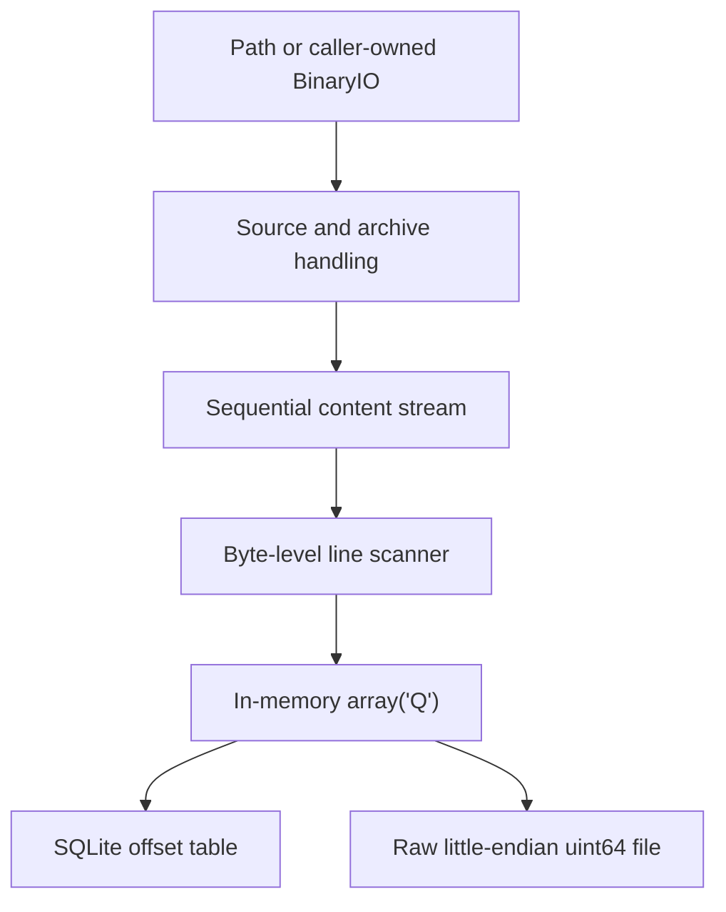

# Archive Line Index architecture

## 1. Purpose

Archive Line Index provides two related but independently usable features:

1. A read-only sequential binary stream over either a plain file or the sole regular-file member of a supported archive. The stream performs decompression when necessary.
2. A byte-level line index built by consuming that stream.

The binary stream is a first-class public feature rather than an internal detail of the index builder. The indexer depends only on a readable binary stream and has no knowledge of archive formats or decompression.

The project processes large inputs incrementally. It does not extract archive members to the filesystem or retain the complete decompressed content in memory.

## 2. Architectural overview



The dependency direction is one-way:

- source and archive handling produces decompressed bytes;
- the content stream exposes those bytes through a common pull interface;
- the scanner consumes that interface and produces offsets;
- persistence serializes the completed offset sequence.

Archive handling must not depend on line semantics. Line scanning must not depend on archive backends. SQLite and raw-binary persistence must not affect how the offset sequence is constructed.

## 3. Scope

### 3.1 Included

- Plain, uncompressed files.
- ZIP archives through Python's `zipfile` module.
- TAR archives and compression variants supported by Python's `tarfile` module.
- 7z archives through `py7zr`.
- Filesystem paths and caller-provided binary streams as input.
- Exactly one regular-file member in an archive.
- Sequential delivery of original decompressed bytes.
- LF-delimited byte-line indexing.
- Optional exclusion of an initial UTF-8 BOM from the first line.
- An in-memory `array("Q")` offset representation.
- SQLite and raw little-endian `uint64` persistence.

### 3.2 Excluded

- Text decoding or encoding detection.
- Newline normalization.
- JSONL parsing or validation.
- Passwords, encrypted archives, or password discovery.
- Filesystem extraction of archive members.
- Random seeking within compressed input.
- Compression-format-specific seek indexes or decompression checkpoints.
- Memory-mapped access to the raw index file.
- Index metadata, source identity, archive fingerprints, and stale-index detection.
- Association of an index with a particular source archive.

## 4. Source and ownership model

An input source is either:

```python
str | PathLike[str] | BinaryIO
```

For a path, the package owns and closes the opened file. A caller-provided binary stream remains caller-owned and is not closed by the package. Processing starts at the stream's current position, and that position is not restored.

Caller-provided streams must return bytes. Formats whose selected backend requires seeking may reject a non-seekable source with a clear error. A non-seekable source remains valid for plain content and for archive modes that can process it incrementally.

Format detection may read an initial prefix. If the input is ultimately treated as plain content and cannot be rewound, that prefix must be replayed so that no content bytes are lost.

## 5. Format detection and archive validation

Detection prefers file signatures and content over filename suffixes. Filename suffixes remain significant when they claim an archive format: a source with a recognized archive suffix but invalid archive content fails rather than being silently reinterpreted as a plain file.

An accepted archive contains exactly one regular-file member after directory entries are excluded.

- An empty regular file is valid.
- A regular file within archive directories is valid.
- Member filenames and suffixes are unrestricted.
- Symbolic links, hard links, devices, and other special entries are invalid.
- Metadata files are not silently ignored.
- Zero or multiple regular-file members are invalid.

Archive paths are used only as member metadata and for selecting the validated member. No archive path is materialized on the filesystem.

Encrypted archives are unsupported. The public API exposes no password parameter and performs no prompting or password lookup.

Some streaming formats cannot prove the complete archive structure or terminal integrity before delivering member bytes. In those cases, earlier reads may succeed before a later read reports an additional member, corrupt footer, CRC failure, or decompression failure. Only successful terminal EOF proves complete processing under the backend's available validation.

## 6. Content-stream abstraction

The public stream is a context-managed, read-only binary stream. It provides the readable subset of Python's binary I/O behavior.

It is:

- sequential;
- non-writable;
- non-seekable;
- explicitly closeable;
- safe to use as a context manager.

The stream returns the exact decompressed member bytes. In particular, it does not remove a BOM, decode characters, recognize line endings, or transform the content in any way. A plain file passes through the same abstraction without a decompression step.

Ordinary bounded reads retain bounded-memory behavior. As with conventional Python binary streams, an explicit `read(-1)` may cause the caller to materialize all remaining content.

The stream counts actual decompressed bytes. If a maximum decompressed size is configured, trustworthy member metadata may reject an oversized member early, but actual delivered bytes are counted independently. The stream fails as soon as the actual count exceeds the limit.

Closing the stream early cancels remaining work, releases owned resources, and terminates any package-owned extraction thread. Early closure is not reported as an extraction error, but it also does not establish complete archive integrity.

## 7. Backend model

Each backend presents the content-stream layer with the same internal readable byte interface. The common wrapper is responsible for buffering, decompressed byte counting, size-limit enforcement, error translation, and lifecycle management.

### 7.1 Pull-based backends

Plain files, ZIP members, and TAR members naturally expose pull-based reads. Their adapters read bounded byte chunks directly from the underlying file or member stream.

### 7.2 7z push-to-pull adaptation

`py7zr` delivers extracted data to a writer callback. The 7z backend adapts this push model to the public pull stream:

```text
py7zr extraction worker
          |
          v
bounded queue of byte blocks
          |
          v
sequential stream reads
```

Exactly one outer extraction thread is required for an active 7z content stream. The byte queue is bounded so that extraction cannot run arbitrarily far ahead of consumption. The callback and worker observe cooperative cancellation, including while waiting for queue capacity. Closing the public stream unblocks both sides and joins the worker.

Pull-based backends do not require this thread-and-queue mechanism. Backend implementations share an interface and observable stream contract, not necessarily identical internal mechanics.

## 8. Byte-line semantics

The index describes LF-delimited byte ranges in the decompressed byte space. It is not a decoded logical-line index.

- Byte `0x0A` is the only line terminator.
- A terminating LF belongs to the line it terminates.
- In CRLF, both the CR and LF therefore belong to the line.
- A lone CR is ordinary line content.
- A final unterminated sequence of bytes is a line.
- A terminal LF does not create an additional empty line after it.
- Empty lines terminated by LF are preserved.
- An empty input contains no lines.

An initial UTF-8 BOM, `EF BB BF`, may be excluded from the first line. When it is excluded, offsets still address the original decompressed stream: the first line begins at offset `3`, not at a renumbered offset `0`. A BOM appearing anywhere else is ordinary content. UTF-16 and UTF-32 BOM handling is outside scope because a single-byte LF scan does not define general line semantics for those encodings.

## 9. Offset data structure

The in-memory index is an `array("Q")` containing unsigned 64-bit offsets. For `N` lines, the array contains `N + 1` values:

```text
offsets[0]       start of line 0
offsets[1]       start of line 1
...
offsets[N - 1]   start of line N - 1
offsets[N]       decompressed EOF sentinel
```

The EOF sentinel makes every line range derivable without storing a length:

```python
start = offsets[line_number]
end = offsets[line_number + 1]
length = end - start
```

Consequently:

```python
line_count = len(offsets) - 1
decompressed_size = offsets[-1]
```

The array always contains at least the EOF sentinel. Representative values are:

| Decompressed content | Offset sequence |
| --- | --- |
| Empty | `[0]` |
| UTF-8 BOM only, excluded | `[3]` |
| `abc` | `[0, 3]` |
| `abc\n` | `[0, 4]` |
| `\n` | `[0, 1]` |
| `\n\n` | `[0, 1, 2]` |
| UTF-8 BOM followed by `abc\n` | `[3, 7]` |

For a nonempty line set, offsets are strictly increasing. The final and maximum offset is always the EOF sentinel.

Although `array("Q")` supports unsigned values through `2^64 - 1`, SQLite `INTEGER` is signed 64-bit. The shared representable offset range is therefore `0` through `2^63 - 1`, which is the effective architectural limit.

## 10. Scanning algorithm

The scanner operates over bounded byte blocks:

1. Read only enough initial content to decide whether the UTF-8 BOM is present.
2. Establish the first candidate line start as offset `0` or `3`.
3. Search each block for LF using `bytes.find(b"\n")`.
4. When an LF completes a line, append that line's start offset and advance the candidate start to the byte immediately after the LF.
5. Continue searching the current block, then read the next block.
6. At EOF, append the candidate start if bytes remain after the last LF.
7. Append the absolute decompressed EOF offset as the sentinel.

Absolute byte position is maintained independently of block boundaries. A line may cross any number of blocks without being copied or assembled because the indexer needs only its start and terminating position. `bytes.find()` performs the byte search in optimized native code; the scanner does not iterate over individual bytes in Python.

The completed array is made available for persistence only after the stream reaches successful terminal EOF. A late archive or decompression failure invalidates the entire build.

The indexer's retained memory consists primarily of:

```text
8 * (line_count + 1) bytes for the offset array
+ one bounded input block
+ archive/decompressor state
+ bounded 7z queue storage, when applicable
```

Memory therefore scales with line count but not with total decompressed content size or line length.

## 11. SQLite representation

SQLite stores the same offset sequence as rows:

```sql
CREATE TABLE line_index (
    offset INTEGER PRIMARY KEY
);
```

The EOF sentinel is stored as the final and greatest row. No line number or length column is stored. The in-memory order is reconstructed with:

```sql
SELECT offset
FROM line_index
ORDER BY offset;
```

For a valid table:

```text
line count        = COUNT(*) - 1
decompressed size = MAX(offset)
```

The table always contains at least one row: the EOF sentinel. Its purpose is ordered offset storage and byte-offset lookup. Efficient lookup by line ordinal is instead provided by the in-memory or raw-binary sequence; SQLite has no line-number key.

Population occurs within a transaction and begins only after the complete offset array has been built successfully. A persistence failure must not leave a partially populated table presented as a completed index.

## 12. Raw binary representation

The second persisted representation is a headerless sequence of little-endian unsigned 64-bit integers:

```text
uint64-le offsets[0]
uint64-le offsets[1]
...
uint64-le offsets[N]    # EOF sentinel
```

The raw file contains exactly the same values, in the same order, as the in-memory array and SQLite table. Its size is always:

```python
(line_count + 1) * 8
```

The raw format is explicitly little-endian. Because `array("Q")` uses native byte order, serialization byte-swaps on a big-endian host. The raw file can be loaded back into `array("Q")` or consumed by another language using the same fixed-width definition.

The format contains no header, magic value, version, source identity, BOM flag, or other metadata. Structural readers can require a nonzero file size divisible by eight and may additionally verify that decoded offsets are strictly increasing.

Memory-mapped access is compatible with this representation but is outside the current project scope.

## 13. Persistence relationship

SQLite and the raw binary file are separate projections of one successfully completed in-memory array:

```text
array("Q")
    |-- insert offsets into SQLite
    `-- serialize offsets as uint64-le
```

Neither persisted representation contains source identity or establishes that it belongs to a particular archive. Naming, placement, association, staleness, and replacement policy are the caller's responsibility unless separately added to a later specification.

There is no cross-file transaction between SQLite and the raw file. Each output must avoid exposing its own partial state: SQLite uses a transaction, while the raw representation is written to a temporary file and published only after the write completes successfully.

## 14. Error and completion model

The architecture distinguishes:

- unsupported or invalid formats;
- invalid archive structure;
- encrypted archives;
- decompressed-size limit violations;
- extraction or decompression failures;
- text-independent indexing failures;
- persistence failures;
- ordinary filesystem and argument errors.

Backend-specific failures are translated to stable package-level errors while retaining the original cause. Failures originating in the 7z extraction worker are transported to and raised by the consuming thread.

Previously read bytes cannot be withdrawn. Accordingly, a standalone stream consumer may receive valid bytes before a late failure. The index builder does not publish an array or persisted index until the stream has been exhausted successfully.

## 15. Architectural invariants

The implementation must preserve the following invariants:

1. The content stream returns original decompressed bytes without text-level transformation.
2. Archive content is never extracted to the filesystem.
3. At most one regular-file member is accepted.
4. The scanner recognizes only LF byte boundaries.
5. Every stored offset addresses the original decompressed byte space.
6. For `N` lines, every representation contains exactly `N + 1` offsets.
7. The final offset is always decompressed EOF.
8. Line `i` occupies the half-open byte range `[offsets[i], offsets[i + 1])`.
9. SQLite and the raw file contain the same logical offset sequence as the completed `array("Q")`.
10. No completed index is exposed following an archive, scanning, or persistence failure.
11. Bounded stream reads do not cause the decompressed content to be retained in full.
12. Source identity and index-to-archive association remain outside the package's indexing model.
