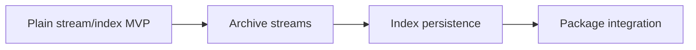

# Archive Line Index implementation plan

## 1. Purpose

This plan defines how to implement the complete system specified by [SPEC.md](SPEC.md) from scratch in bounded, dependency-ordered, independently verifiable increments.

It is an executable blueprint rather than a chronology. Tasks describe the current required implementation, not abandoned approaches or later migrations. The physical-ownership map rooted at [layout.md](layout.md) applies to every phase. Detailed production-module ownership and import constraints are defined in [layout/src.md](layout/src.md).

## 2. Implementation principles

1. Implement dependencies before dependents.
2. Keep each task as small as possible while leaving the repository internally consistent and testable.
3. Normally change one production module plus its directly associated tests and documentation. Span multiple files only when an atomic contract declaration and implementation cannot be separated safely.
4. Test through public behavior where practical; use implementation-level unit tests for boundary algorithms, backend translation, and failure paths.
5. Generate archive fixtures during tests unless an immutable malformed sample cannot be constructed reliably.
6. Preserve ordinary Python exceptions required by the public contract and verify chained causes for translated errors.
7. Do not add metadata, a CLI, mmap access, random decompressed seeking, or other non-goals while implementing adjacent functionality.

## 3. Phase order

The top-level implementation phases are:

1. [Plain stream and index MVP](plan/plain-stream-index-mvp.md)
2. [Archive streams](plan/archive-streams.md)
3. [Index persistence](plan/index-persistence.md)
4. [Package integration](plan/package-integration.md)

Each phase depends on completion of every preceding phase. Each phase plan decomposes its ordered tasks into named milestones. The derived [ROADMAP.md](ROADMAP.md) mirrors this phase/milestone/task hierarchy and records durable completion; it does not redefine order or scope.



The first phase produces the smallest useful product: a public sequential binary stream over plain input plus correct in-memory line indexing. Later phases reuse those contracts without replacing them.

## 4. Phase responsibilities

### Plain stream and index MVP

Implements foundational errors, path normalization, format classification needed to reject not-yet-enabled archives, internal backend protocol, plain backend, common content stream, offset representation, scanner, and public composition.

At completion, callers can stream and index plain paths, and can directly scan arbitrary readable binary streams, with all byte-line/BOM/EOF semantics and deterministic ownership behavior tested.

### Archive streams

Implements unencrypted ZIP, TAR, and 7z backends, completes dispatch for every supported format, and verifies identical public byte/index behavior across formats. The threaded 7z adapter is built last because it depends on the stable pull reader and stream lifecycle contracts. TAR uses one sequential streaming strategy for filesystem paths.

### Index persistence

Implements strict SQLite and raw-binary round trips from the stable offset representation, then exposes them through the public API. It verifies safe publication, replacement protection, format rejection, and cross-format equivalence.

### Package integration

Finalizes curated exports, user documentation, dependency constraints, installed-wheel verification, platform-sensitive lifecycle tests, and the complete acceptance suite. It adds no new architectural capability.

## 5. Dependency order

Using `A → B` to mean that **B depends on A**, implementation follows:

```text
errors → sources → formats
errors → backend base
sources + formats + backend base → plain/ZIP/TAR/7z backends
concrete backends → backend registry
backend base → content stream
offset representation → scanner
registry + content stream + scanner → public API
offset representation → SQLite/raw persistence → public API
public API → package exports and installed-package verification
```

The scanner can be developed after the offset representation without waiting for archive backends. Persistence can be developed after offsets but is scheduled after archive integration so the public source-to-index pipeline is stable before adding output formats.

No task may introduce a reverse dependency prohibited by [layout/src.md](layout/src.md).

## 6. Task verification protocol

After every implementation task:

1. Run the unit tests associated with the changed module.
2. Fix all failures until those tests pass.
3. Run relevant integration tests and unit tests for dependent components.
4. Fix every regression before starting the next task.
5. When operating in a Git repository under the companion recovery protocol, commit the verified task independently.

A test command that cannot run because a dependency or tool is absent is not a passing result. Inspect the active environment, use an available permitted installation mechanism where appropriate, or record the concrete blocker. Do not skip verification merely because an initial command is unavailable.

## 7. Phase-boundary verification

At the end of each phase:

- run the full test suite implemented so far;
- run static analysis and formatting checks configured in `pyproject.toml`;
- verify no live package-owned thread or open package-owned file remains after resource tests;
- inspect imports for dependency-direction violations;
- update relevant SPEC, PLAN, layout, and user documentation if implementation discoveries changed a settled contract;
- confirm no temporary fixture or index artifact remains in the repository.

The phase is incomplete while any test is failing or skipped without an explicit, specification-consistent platform reason.

## 8. Final verification

After all phases:

1. Run the complete unit and integration suite on every supported platform available to the project.
2. Run slow large-input memory and backpressure tests.
3. Build both source distribution and wheel.
4. Install the wheel into a clean environment outside the repository.
5. Import every documented public name.
6. Execute representative plain, ZIP, TAR, and 7z stream/index workflows.
7. Execute SQLite and raw round trips from the installed package.
8. Verify missing optional repository paths do not affect installed behavior.
9. Inspect built artifacts for unintended test fixtures, caches, generated indexes, or private development files.
10. Confirm README examples and the complete SPEC acceptance conditions.

The project is complete only when every system-level acceptance condition in `SPEC.md` is supported by a passing test or an explicitly documented manual verification appropriate to that condition.
