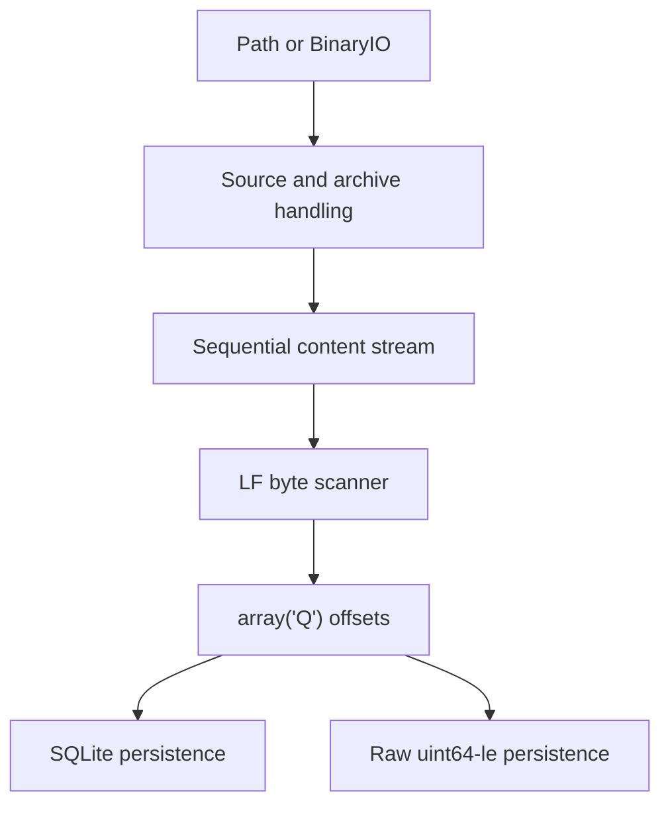

# Archive Line Index specification

## 1. Purpose

Archive Line Index is a Python package for working with a single byte-oriented text payload stored either as a plain file or as the sole regular-file member of a supported archive.

It provides two independently useful capabilities:

1. A read-only sequential binary stream that exposes the original payload bytes while performing decompression when required.
2. A byte-line index that records the start of every LF-delimited line plus a final decompressed-EOF sentinel.

The package can retain the index in memory as `array("Q")` and persist that same ordered offset sequence either in SQLite or as headerless little-endian unsigned 64-bit integers.

The package is intended for inputs whose decompressed content may be much larger than available memory. It never materializes or extracts the complete payload as part of normal bounded-read processing. Index memory scales with line count rather than decompressed byte size.

## 2. Complete scope

The system shall support:

- Python 3.11 and later on Windows, Linux, and macOS;
- filesystem paths and caller-provided binary streams;
- plain, ZIP, TAR, compressed-TAR, and 7z inputs;
- exactly one regular-file member per accepted archive;
- content-first format detection with strict recognized-suffix handling;
- sequential, read-only decompressed byte access;
- deterministic close, cancellation, and resource cleanup;
- LF byte-line scanning without text decoding;
- optional exclusion of an initial UTF-8 BOM from the first line;
- an in-memory unsigned 64-bit offset array with an EOF sentinel;
- dedicated SQLite index files containing `line_index(offset INTEGER PRIMARY
  KEY)`;
- raw headerless little-endian `uint64` index files;
- independent reading and writing of both persistence formats.

## 3. Non-goals

The system shall not provide:

- text decoding, encoding detection, or newline normalization;
- recognition of line boundaries other than byte `0x0A`;
- parsing or validation of JSONL or any other record format;
- passwords, encrypted-archive support, prompting, or credential discovery;
- extraction of archive member paths to the filesystem;
- random seeking within compressed data;
- compression checkpoints or compression-format-specific seek indexes;
- memory-mapped index access;
- index metadata, archive identity, fingerprints, or stale-index detection;
- automatic association of an index with a source archive;
- automatic index-output naming based on an input path;
- a command-line interface.

## 4. Principal use cases

### 4.1 Standalone sequential content access

A caller opens a path or binary stream and consumes original decompressed bytes through a conventional readable binary interface. The caller may stop early and close deterministically or consume to terminal EOF to establish every integrity check available from the selected backend.

### 4.2 Build an in-memory line index

A caller scans any compatible `BinaryIO` directly, or asks the package to open an archive/plain source and scan its content. The result is an `array("Q")` containing line starts followed by the decompressed EOF sentinel.

### 4.3 Persist and reload offsets

A caller writes a completed offset array to a dedicated SQLite file, a raw binary file, or both. Each persisted representation can later be loaded into a new `array("Q")`. The caller owns naming and association of these files with the original source.

## 5. Architecture



The system consists of four principal responsibilities:

1. **Content acquisition** normalizes input ownership, detects format, validates archive structure, and selects a decompression backend.
2. **Content streaming** provides the backend-independent read-only sequential byte interface, byte counting, size-limit enforcement, and cleanup.
3. **Line indexing** scans any readable binary stream and constructs the canonical in-memory offset sequence.
4. **Persistence** converts a completed offset sequence to and from either SQLite rows or raw little-endian integers.

Dependencies are acyclic. Archive handling does not depend on line semantics. Line indexing does not depend on archive handling or a concrete stream class. Persistence does not depend on sources, archives, or scanning. Only the public API composition layer coordinates the full pipeline.

The canonical physical ownership and allowed import directions are defined in [layout.md](layout.md).

## 6. System-wide terminology

**Source**
: A filesystem path or caller-provided readable binary stream supplied to the
  content-opening API.

**Payload**
: The plain file's bytes or the decompressed bytes of the archive's sole
  accepted regular-file member.

**Decompressed byte space**
: The zero-based address space of the payload before any BOM exclusion. Every
  stored offset refers to this space.

**Content stream**
: The package-owned read-only sequential binary interface exposing payload
  bytes.

**Byte line**
: A half-open payload range ending immediately after an LF byte, or at payload
  EOF for a final unterminated line.

**Line offset**
: The absolute start of a byte line in decompressed byte space.

**EOF sentinel**
: The final offset value, equal to total decompressed payload size. It is not a
  line start.

**Completed index**
: An offset sequence returned only after successful terminal EOF and all
  backend integrity validation available at that point.

## 7. System-wide invariants

1. The content stream returns original payload bytes without text-level transformation.
2. No archive member is extracted to a filesystem path.
3. Every accepted archive contains exactly one regular-file member after directories are excluded and contains no unsupported special entry.
4. Byte `0x0A` is the only indexed line terminator.
5. Every offset addresses the original decompressed byte space, including when an initial UTF-8 BOM is excluded from the first line.
6. For `N` lines, the canonical offset sequence contains exactly `N + 1` values.
7. The final value is always the decompressed EOF sentinel.
8. Line `i` occupies `[offsets[i], offsets[i + 1])`.
9. A completed index always contains at least the EOF sentinel.
10. Persisted SQLite and raw indexes represent exactly the same logical offset sequence as the validated in-memory array.
11. No completed index or replacement persistence file is published following source, archive, decompression, scanning, validation, or persistence failure.
12. Bounded reads do not retain the complete decompressed payload.
13. Caller-provided source streams are never closed by the package.
14. Package-owned threads terminate following deterministic stream cleanup.

## 8. Top-level contracts

The supported public Python surface, validation policy, and exceptions are defined in [spec/public-api.md](spec/public-api.md).

The content-stream lifecycle, byte-delivery, size-limit, and completion contracts are defined in [spec/content-stream.md](spec/content-stream.md).

Format detection, archive validation, backend behavior, encryption rejection, and 7z concurrency are defined in [spec/archive-handling.md](spec/archive-handling.md).

Byte-line semantics, BOM treatment, offset-array invariants, and the scanning algorithm are defined in [spec/line-index.md](spec/line-index.md).

SQLite and raw-binary representations, safe publication, and loading are defined in [spec/persistence.md](spec/persistence.md).

When a subject is defined in a child specification, that child is normative. This root specifies only the system-level guarantee and relationship.

## 9. Dependency constraints

Using `A → B` to mean that **B depends on A**, the principal dependency paths are:

```text
errors → sources → formats → archive backends → backend registry → public API
errors → backend base → archive backends
backend base → content stream → public API
offset representation → scanner → public API
offset representation → persistence adapters → public API
```

No directed cycle is permitted. Public package initialization must not become a dependency of internal modules. `py7zr` is isolated to the 7z backend.

## 10. Resource and scaling model

For bounded reads, retained memory may include:

- archive/decompressor state;
- source and stream buffers;
- one current scan block;
- one bounded 7z producer-queue block plus unavoidable backend callback data;
- the `array("Q")` containing one 8-byte value per line plus the EOF sentinel.

Memory use does not scale with total payload size or longest line merely for indexing, because the scanner never assembles complete lines. An explicit unbounded stream read or loading an entire raw/SQLite index into memory is a caller-selected materialization operation.

## 11. System acceptance conditions

The complete project is conformant when:

1. Equivalent plain, ZIP, TAR, and 7z payloads yield byte-identical bounded reads and identical indexes.
2. Inputs substantially larger than available memory can be streamed without extraction or complete payload retention.
3. Empty, BOM-only, LF-terminated, unterminated, empty-line, CRLF, and lone-CR cases produce the specified offsets and EOF sentinel.
4. Newlines and UTF-8 BOM bytes split across every relevant source/backend boundary are handled correctly.
5. Archives with zero, multiple, encrypted, corrupt, truncated, or special members fail through the specified error model.
6. Successful terminal EOF includes all integrity checks available from the selected backend; early closure is explicitly non-validating.
7. Caller-owned streams remain open, while every package-owned file, archive, queue, and worker is released by deterministic cleanup.
8. SQLite rows ordered by offset and decoded raw `uint64` values exactly equal the source `array("Q")`.
9. Existing persistence destinations are protected unless replacement is explicitly authorized.
10. Failed replacement leaves the previous destination intact.
11. Unit, cross-format integration, resource-lifecycle, persistence-equivalence, and installed-wheel tests all pass on supported platforms.
12. The installed package works outside the repository without path injection or undeclared runtime dependencies.
