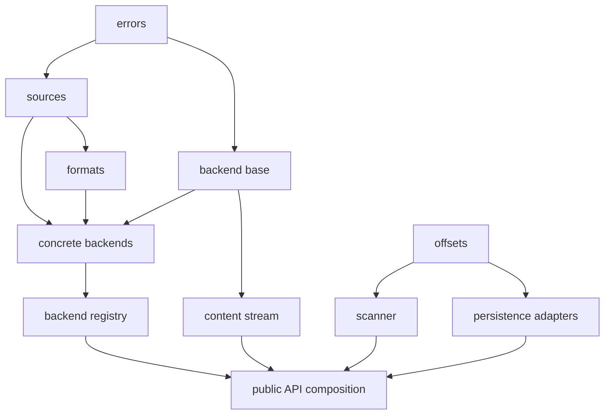

# Project layout

## 1. Purpose and authority

This document is the canonical description of the Archive Line Index project's physical organization. It defines where production code, tests, development specifications, plans, and generated artifacts belong; the responsibility of each important location; and the import boundaries that preserve the system architecture.

The root specification defines required system behavior. The root plan defines the ordered implementation strategy. This document owns neither behavior nor implementation sequencing: it maps those concerns onto files and directories. When a proposed implementation does not fit this layout cleanly, the architectural boundary and this document shall be reconsidered rather than working around the mismatch with circular imports or duplicated logic.

## 2. Repository layout

The intended repository structure is:

```text
archive-line-index/
├── .gitignore
├── LICENSE
├── README.md
├── pyproject.toml
├── docs/
│   └── dev/
│       ├── SPEC.md
│       ├── spec/
│       │   ├── public-api.md
│       │   ├── content-stream.md
│       │   ├── archive-handling.md
│       │   ├── line-index.md
│       │   └── persistence.md
│       ├── PLAN.md
│       ├── plan/
│       │   ├── plain-stream-index-mvp.md
│       │   ├── archive-streams.md
│       │   ├── index-persistence.md
│       │   └── package-integration.md
│       └── layout.md
├── src/
│   └── archive_line_index/
│       ├── __init__.py
│       ├── api.py
│       ├── errors.py
│       ├── sources.py
│       ├── formats.py
│       ├── stream.py
│       ├── offsets.py
│       ├── scanner.py
│       ├── backends/
│       │   ├── __init__.py
│       │   ├── base.py
│       │   ├── registry.py
│       │   ├── plain.py
│       │   ├── zip.py
│       │   ├── tar.py
│       │   └── sevenzip.py
│       └── persistence/
│           ├── __init__.py
│           ├── sqlite.py
│           └── raw.py
└── tests/
    ├── conftest.py
    ├── helpers/
    │   ├── archive_factory.py
    │   ├── binary_cases.py
    │   └── streams.py
    ├── fixtures/
    │   └── README.md
    ├── unit/
    │   ├── test_sources.py
    │   ├── test_formats.py
    │   ├── test_stream.py
    │   ├── test_offsets.py
    │   ├── test_scanner.py
    │   ├── backends/
    │   │   ├── test_plain.py
    │   │   ├── test_zip.py
    │   │   ├── test_tar.py
    │   │   └── test_sevenzip.py
    │   └── persistence/
    │       ├── test_sqlite.py
    │       └── test_raw.py
    └── integration/
        ├── test_content_stream.py
        ├── test_index_building.py
        ├── test_persistence_equivalence.py
        └── test_resource_lifecycle.py
```

The documentation and plan trees may be decomposed further when a node becomes too broad, but new files must correspond to a meaningful architectural or implementation boundary. Production modules follow the same rule: a module is split only when it acquires multiple independently understandable responsibilities.

## 3. Repository-root files

### `pyproject.toml`

Owns build-system configuration, distribution metadata, the minimum supported Python version, runtime and development dependencies, package discovery, and tool configuration.

The distribution name is hyphenated for packaging, while the import package uses underscores:

```text
distribution: archive-line-index
import:       archive_line_index
```

The project uses a `src` layout. Test execution must therefore exercise the installed package or an equivalent editable installation rather than relying on the repository root accidentally appearing on `sys.path`.

`py7zr` is the only required third-party runtime dependency unless the specification is deliberately expanded. ZIP, TAR, SQLite, binary arrays, threading, queues, and codecs used for fixed binary serialization come from the Python standard library.

Tool settings that apply to the entire repository belong here when supported by the tool, including pytest discovery and optional coverage, formatting, or static-analysis configuration. Tool-specific standalone files should be added only when `pyproject.toml` cannot express the required configuration clearly.

### `README.md`

Provides the user-facing package overview, installation instructions, short examples, supported input formats, and links into the detailed development documentation. It does not duplicate the normative behavioral detail in the SPEC tree.

### `LICENSE`

Contains the project license and has no runtime role.

### `.gitignore`

Excludes build output, virtual environments, test caches, coverage output, editor state, generated archives, temporary persistence files, and local index databases or raw offset files. It must not ignore source fixtures intentionally kept under `tests/fixtures/`.

## 4. Development-document tree

### `docs/dev/SPEC.md`

The compact authoritative entry point for the complete system specification. It owns project purpose, complete scope, non-goals, architectural decomposition, system-wide terminology and invariants, the subspecification scope map, and system-level acceptance conditions.

### `docs/dev/spec/public-api.md`

Owns the public Python surface:

- exported functions, classes, aliases, and constants;
- argument validation visible to callers;
- source ownership rules;
- context-management and closure contracts;
- exception hierarchy and propagation guarantees;
- which names are re-exported from `archive_line_index`.

It links to component specifications for detailed stream, archive, indexing, and persistence behavior rather than repeating those requirements.

### `docs/dev/spec/content-stream.md`

Owns the common sequential binary-stream contract, including read behavior, buffering guarantees, byte counting, decompressed-size limits, early closure, terminal integrity semantics, and the distinction between owned and caller-owned resources.

### `docs/dev/spec/archive-handling.md`

Owns input-format detection, recognized suffix behavior, exactly-one-member validation, special-entry rejection, encryption policy, backend-specific constraints, and 7z push-to-pull adaptation.

### `docs/dev/spec/line-index.md`

Owns LF byte-line semantics, initial UTF-8 BOM treatment, decompressed-offset meaning, the `array("Q")` representation, the EOF-sentinel invariant, the bounded-block scanning algorithm, and index completion rules.

### `docs/dev/spec/persistence.md`

Owns the SQLite table contract, raw little-endian `uint64` format, conversion between native-endian memory and portable persistence, transactional or atomic publication requirements for each representation, and persistence failure behavior.

It explicitly does not own source identity, index metadata, stale-index detection, or association of an index with an archive.

### `docs/dev/PLAN.md`

The compact authoritative entry point for implementing the complete system from scratch. It declares the top-level phase order, phase dependencies, SPEC-to-plan mapping, and project-wide verification and completion rules.

### `docs/dev/plan/plain-stream-index-mvp.md`

Describes the smallest useful testable product: plain-source ownership and streaming, byte-line scanning, the in-memory offset representation, and a thin public composition path. It excludes archive decoding and persistence.

### `docs/dev/plan/archive-streams.md`

Adds content detection and the ZIP, TAR, and 7z backends to the already tested stream/index pipeline. It orders the pull-based backends before the threaded 7z adapter and includes cross-format behavioral verification.

### `docs/dev/plan/index-persistence.md`

Adds SQLite and raw-binary serialization from the stable in-memory offset contract. It includes failure-path tests and equivalence verification between the two representations.

### `docs/dev/plan/package-integration.md`

Completes the curated package exports, packaging verification, installed-package tests, documentation synchronization, and full acceptance suite. It must not become a catch-all for functionality that belongs in an earlier component phase.

### `docs/dev/layout.md`

This file. It is shared canonical input to the SPEC and PLAN trees. SPEC nodes may refer to module locations, and plan tasks may name files to create or modify, but neither tree should duplicate the detailed ownership map here.

### Other documents under `docs/`

Exploration notes or temporary architecture documents outside `docs/dev/` are not normative. Once their settled content has been integrated into the authoritative SPEC, PLAN, and layout trees, they should be removed unless they retain a distinct, durable explanatory purpose.

## 5. Production package

### `src/archive_line_index/__init__.py`

Defines the supported package-level import surface by re-exporting only names declared public in `spec/public-api.md`. It contains no algorithms, backend selection, resource management, or persistence logic.

Internal modules never import from `archive_line_index.__init__`; they import from the module that canonically owns the required definition. This prevents initialization cycles and keeps dependency direction visible.

### `src/archive_line_index/api.py`

Owns thin orchestration functions that compose lower-level components into public operations, such as opening a content stream from a source or building and persisting an index.

This module may:

- validate cross-component argument combinations;
- open or attach to a source;
- request format detection and backend selection;
- wrap a backend reader in the common content stream;
- pass that stream to the scanner;
- send a completed offset array to a persistence adapter;
- coordinate deterministic cleanup when composition fails.

It must not implement signature detection, decompression, LF scanning, offset serialization, SQL insertion, or backend-specific error handling.

### `src/archive_line_index/errors.py`

Owns the complete package exception hierarchy and any small helpers used only to translate lower-level failures while preserving their causes.

It is a foundational module and imports no other project module. Ordinary Python exceptions that the public contract preserves, such as `FileNotFoundError`, `PermissionError`, or invalid-argument `ValueError`, are not redefined here.

### `src/archive_line_index/sources.py`

Owns source normalization and lifetime boundaries:

- the accepted path-or-binary-stream source alias;
- opening path sources;
- attaching to caller-owned streams without assuming ownership;
- seekability and byte-return validation;
- replay of prefixes consumed while detecting non-seekable plain input;
- idempotent release of package-owned source resources.

It does not detect archive formats or understand archive members.

### `src/archive_line_index/formats.py`

Owns format classification and detection:

- the internal format identifier;
- archive signatures and recognized suffixes;
- content-first detection rules;
- strict handling of misleading recognized archive suffixes;
- the bounded prefix requirements used during detection.

It consumes the source abstraction without taking over source ownership. It does not open archive members or produce the public content stream.

### `src/archive_line_index/stream.py`

Owns the common read-only sequential content-stream implementation. It wraps an already selected backend reader and supplies backend-independent behavior:

- the public readable binary-I/O surface;
- optional buffering;
- actual decompressed-byte counting;
- maximum-size enforcement;
- normal EOF versus failure distinction;
- idempotent closure and context management;
- preservation of caller-owned source lifetime;
- cleanup delegation to the selected backend reader.

It does not detect formats, inspect archive members, scan for lines, or create persistence output.

### `src/archive_line_index/offsets.py`

Owns the in-memory offset representation and its structural invariants:

- construction of unsigned 64-bit `array("Q")` values;
- the mandatory EOF sentinel;
- derivation of line count and byte ranges;
- monotonicity and representable-range validation;
- shared checks required before persistence or after loading raw offsets.

It does not read content bytes, interact with archives, execute SQL, or choose a persistent byte order.

This module is the common lower-level contract on which scanning and both persistence adapters depend. Shared offset invariants must not be duplicated in those consumers.

### `src/archive_line_index/scanner.py`

Owns construction of the in-memory offset sequence from any readable binary stream:

- bounded block reads;
- initial UTF-8 BOM recognition;
- absolute decompressed-position tracking;
- native `bytes.find(b"\n")` scanning;
- line-start collection;
- final unterminated-line handling;
- EOF-sentinel insertion;
- refusal to return a complete index before successful terminal EOF.

The scanner depends on the offset representation but not on sources, format detection, archive backends, the concrete content-stream class, or persistence. Its input contract is structural binary readability, allowing it to index any compatible caller-provided stream in isolation.

## 6. Archive backends

### `src/archive_line_index/backends/__init__.py`

Marks the backend package. It does not eagerly import every concrete backend or serve as a second public API surface. Backend registration and selection belong to `registry.py`.

### `src/archive_line_index/backends/base.py`

Owns the internal reader protocol implemented by every backend and the common backend result needed by the stream wrapper. The protocol is deliberately smaller than the public stream abstraction: it supplies bounded reads and resource closure, while `stream.py` supplies the public semantics.

The base module must not import any concrete backend.

### `src/archive_line_index/backends/registry.py`

Maps a detected format to its concrete backend factory. This is the only production module that imports all concrete backend implementations.

It performs dispatch only. Format detection remains in `formats.py`, and the public content-stream wrapper remains in `stream.py`.

### `src/archive_line_index/backends/plain.py`

Adapts an uncompressed source to the internal reader protocol. It preserves any prefix consumed during detection and reads bounded byte blocks without loading the complete file.

### `src/archive_line_index/backends/zip.py`

Owns ZIP inspection, exactly-one-regular-member validation, encrypted-member rejection, member opening, bounded decompressed reads, ZIP error translation, and ZIP resource cleanup. It uses `zipfile` and never extracts to a filesystem path.

### `src/archive_line_index/backends/tar.py`

Owns TAR and supported compressed-TAR inspection, member validation, member streaming, TAR error translation, and cleanup. It uses `tarfile` without filesystem extraction. It also owns the backend-specific distinction between validation possible before content delivery and validation completed only at terminal EOF.

### `src/archive_line_index/backends/sevenzip.py`

Owns all `py7zr`-specific behavior:

- archive inspection and member validation;
- encrypted-archive rejection when distinguishable;
- the custom `WriterFactory` and `Py7zIO` destination;
- the extraction worker thread;
- the bounded byte-block queue;
- cooperative cancellation and producer unblocking;
- worker-to-consumer EOF and failure messages;
- joining the worker and releasing 7z resources.

No other production module imports `py7zr`. If this module later becomes too broad, it may be decomposed into a `backends/sevenzip/` package with an overview module, but the entire subtree retains this same backend responsibility.

## 7. Persistence package

### `src/archive_line_index/persistence/__init__.py`

Marks the persistence package and may expose internal persistence protocols used by `api.py`. It does not re-export persistence operations as an alternative public surface unless `spec/public-api.md` explicitly assigns that role.

### `src/archive_line_index/persistence/sqlite.py`

Owns SQLite persistence of the complete offset sequence:

- creation and validation of the `line_index` table;
- transactional replacement or population;
- insertion of line starts and the EOF sentinel;
- reconstruction in ascending offset order;
- SQLite-specific error handling and rollback.

The canonical schema remains small enough to be defined beside its owning code; no separate SQL schema file is required unless the persistence specification later expands substantially.

This module accepts or returns the offset representation. It does not open an archive, scan input bytes, infer source identity, or attach metadata to the index.

### `src/archive_line_index/persistence/raw.py`

Owns the headerless raw offset representation:

- little-endian unsigned 64-bit encoding;
- native-to-little-endian conversion;
- complete-file loading into `array("Q")`;
- structural validation of byte length and decoded offsets;
- temporary-file writing and atomic publication of one completed raw file.

It does not implement memory mapping, embed headers or metadata, derive output names from an archive, or associate the raw file with an SQLite database.

## 8. Dependency rules

The notation `A → B` means that **B depends on A**.

The principal production dependency graph is:



The graph is intentionally acyclic. The following import constraints are normative for physical organization:

| Location | May depend on | Must not depend on |
| --- | --- | --- |
| `errors.py` | Python standard library | Any project module |
| `sources.py` | `errors.py` | Formats, backends, stream, scanner, persistence, API |
| `formats.py` | Errors and source abstractions | Concrete backends, stream, scanner, persistence, API |
| `backends/base.py` | Errors and minimal source types | Concrete backends, stream, scanner, persistence, API |
| Concrete backends | Errors, sources, formats, backend base, their archive library | Stream, scanner, offsets, persistence, API |
| `backends/registry.py` | Formats and concrete backends | Scanner, offsets, persistence, API |
| `stream.py` | Errors and backend base | Detection, concrete backends, scanner, offsets, persistence, API |
| `offsets.py` | Python standard library | Sources, formats, backends, stream, scanner, persistence, API |
| `scanner.py` | Offsets and binary-I/O protocols | Sources, formats, backends, concrete stream, persistence, API |
| Persistence adapters | Errors and offsets | Sources, formats, backends, stream, scanner, API |
| `api.py` | All required lower-level components | Package `__init__.py` |
| Package `__init__.py` | Public API and public errors | Backend and persistence implementation modules |

When two modules appear to need one another, shared definitions must move to a lower-level owner such as `backends/base.py` or `offsets.py`; reciprocal imports are not permitted.

Optional imports must remain localized. In particular, only the 7z backend may import `py7zr`. Standard-library backends must remain usable and testable without importing 7z implementation state until backend dispatch selects it.

## 9. Test organization

The test tree mirrors production ownership without becoming a Python package. No `tests/__init__.py` is required. Tests import the installed `archive_line_index` package or named implementation modules, never by altering `sys.path` inside test files.

### `tests/conftest.py`

Defines narrowly reusable pytest fixtures, temporary paths, parameter sets, and shared cleanup assertions. It must not become a miscellaneous test-helper module containing archive construction or expected-result algorithms.

### `tests/helpers/archive_factory.py`

Creates small plain, ZIP, TAR, compressed-TAR, and 7z inputs for tests. Generated archives live under pytest-provided temporary directories. Helper behavior is test infrastructure and must not import or call production archive-building logic.

### `tests/helpers/binary_cases.py`

Defines the shared byte corpora and expected offset sequences used across plain and archived representations. Canonical cases include empty content, BOM-only content, empty lines, terminal and unterminated lines, CRLF, lone CR, BOM-like bytes away from the beginning, and boundaries split across every relevant read position.

### `tests/helpers/streams.py`

Provides controlled caller-owned streams, non-seekable streams, short-read streams, failing streams, and instrumentation used to verify ownership, backpressure, closure, and error propagation.

### `tests/fixtures/`

Contains only small immutable files that are impractical or unreliable to generate during a test, such as carefully corrupted or externally produced archive cases. `README.md` records each fixture's purpose and reproducible origin. Large real-world archives and generated index outputs are never committed here.

### Unit tests

Unit tests correspond directly to production ownership:

| Production owner        | Primary unit tests                |
| ----------------------- | --------------------------------- |
| `sources.py`            | `unit/test_sources.py`            |
| `formats.py`            | `unit/test_formats.py`            |
| `stream.py`             | `unit/test_stream.py`             |
| `offsets.py`            | `unit/test_offsets.py`            |
| `scanner.py`            | `unit/test_scanner.py`            |
| `backends/plain.py`     | `unit/backends/test_plain.py`     |
| `backends/zip.py`       | `unit/backends/test_zip.py`       |
| `backends/tar.py`       | `unit/backends/test_tar.py`       |
| `backends/sevenzip.py`  | `unit/backends/test_sevenzip.py`  |
| `persistence/sqlite.py` | `unit/persistence/test_sqlite.py` |
| `persistence/raw.py`    | `unit/persistence/test_raw.py`    |

`api.py` is intentionally thin; its meaningful behavior is verified primarily through integration tests. A focused unit test file may be added if it acquires nontrivial argument-validation or cleanup branches, but API composition should not be mocked into a duplicate implementation.

### Integration tests

`tests/integration/test_content_stream.py` exercises public stream behavior across every supported source format, including source ownership, bounded reads, error timing, early closure, and terminal integrity.

`tests/integration/test_index_building.py` verifies that equivalent plain, ZIP, TAR, and 7z content produces the same offset sequence through the public composition path.

`tests/integration/test_persistence_equivalence.py` verifies that the completed in-memory array, rows selected from SQLite in ascending order, and decoded raw `uint64` values are identical, including the EOF sentinel.

`tests/integration/test_resource_lifecycle.py` verifies deterministic cleanup, no surviving 7z extraction worker after closure, caller-owned stream preservation, and cleanup following consumer, backend, scanner, and persistence failures.

## 10. Generated and runtime artifacts

Index outputs are runtime artifacts, not repository content. Callers may place them next to the source archive, but the package does not infer, prescribe, or persist their association with that archive.

The relevant artifact classes are:

| Artifact                                       | Ownership                                 | Repository status              |
| ---------------------------------------------- | ----------------------------------------- | ------------------------------ |
| SQLite database containing `line_index`        | Caller-selected destination               | Ignored                        |
| Raw little-endian `uint64` offset file         | Caller-selected destination               | Ignored                        |
| Temporary raw output                           | Raw persistence adapter until publication | Ignored and cleaned on failure |
| Temporary SQLite journal/WAL files             | SQLite during persistence                 | Ignored                        |
| Generated test archives and indexes            | Individual test via `tmp_path`            | Never committed                |
| `build/`, `dist/`, and wheel metadata          | Packaging tools                           | Ignored                        |
| `.pytest_cache/`, coverage data, HTML coverage | Test tools                                | Ignored                        |

The raw-file extension and database filename are not architectural identifiers. Examples such as `.u64` or `.sqlite3` may be used in documentation, but public operations accept explicit destinations unless a later specification adds a naming policy.

No decompressed member file is a normal project artifact. Archive backends must stream member bytes and must not create extraction output, even temporarily.

## 11. Packaging and installed behavior

Only `src/archive_line_index/` is included as importable production code. Tests and development documents are not imported at runtime. Any documentation or license files included in source or wheel distributions are selected explicitly through packaging configuration rather than by making them package modules.

The installed package must behave identically when invoked outside the repository. Verification therefore includes building a wheel, installing it in an isolated environment, importing the documented public surface, and running representative plain and archive workflows without relying on repository-local paths.

There is no command-line entry point or `__main__.py` in the current layout. Adding a CLI is a feature and requires corresponding SPEC, PLAN, layout, and test updates rather than an unplanned wrapper module.

## 12. Change rules

Layout changes follow the project's specification-driven development protocol:

1. A component split or merge is first reflected in the relevant SPEC ownership boundaries.
2. This layout is updated to map those boundaries to physical files and imports.
3. The PLAN is updated with dependency-ordered tasks that leave every intermediate state testable.
4. Production and test files move together; obsolete paths and duplicate ownership descriptions are removed.

New general-purpose modules such as `utils.py`, `common.py`, or `helpers.py` are prohibited unless they acquire a precise canonical responsibility that cannot belong to an existing component. Cross-cutting constants and types live with the component that owns their meaning, not in a convenience dumping ground.

The current layout is intentionally flat within cohesive components. If archive handling, persistence, tests, or development documentation grows beyond a focused file, it may be recursively decomposed into a subpackage or child document tree while preserving the same public boundary and acyclic dependency direction.
