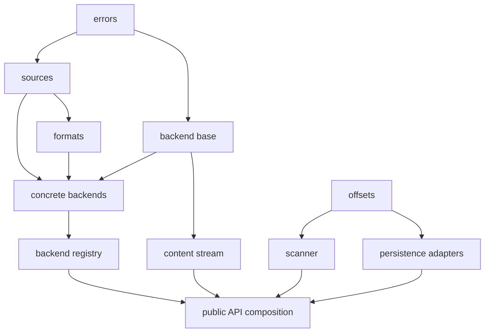

# Production source organization

## 1. Scope

This node owns production module locations, responsibilities, and import directions. Behavioral contracts remain canonical in SPEC.

## 2. Production package

### `src/archive_line_index/__init__.py`

Defines the supported package-level import surface by re-exporting only names declared public in `../spec/public-api.md`. It contains no algorithms, backend selection, resource management, or persistence logic.

Internal modules never import from `archive_line_index.__init__`; they import from the module that canonically owns the required definition. This prevents initialization cycles and keeps dependency direction visible.

### `src/archive_line_index/api.py`

Owns thin orchestration functions that compose lower-level components into public operations, such as opening a content stream from a source or building and persisting an index.

This module may:

- validate cross-component argument combinations;
- open or attach to a source;
- request format detection and backend selection;
- wrap a backend reader in the common content stream;
- pass that stream to the scanner;
- send a completed offset array to a persistence adapter;
- coordinate deterministic cleanup when composition fails.

It must not implement signature detection, decompression, LF scanning, offset serialization, SQL insertion, or backend-specific error handling.

### `src/archive_line_index/errors.py`

Owns the complete package exception hierarchy and any small helpers used only to translate lower-level failures while preserving their causes.

It is a foundational module and imports no other project module. Ordinary Python exceptions that the public contract preserves, such as `FileNotFoundError`, `PermissionError`, or invalid-argument `ValueError`, are not redefined here.

### `src/archive_line_index/sources.py`

Owns source normalization and lifetime boundaries:

- the accepted path-or-binary-stream source alias;
- opening path sources;
- attaching to caller-owned streams without assuming ownership;
- seekability and byte-return validation;
- replay of prefixes consumed while detecting non-seekable plain input;
- idempotent release of package-owned source resources.

It does not detect archive formats or understand archive members.

### `src/archive_line_index/formats.py`

Owns format classification and detection:

- the internal format identifier;
- archive signatures and recognized suffixes;
- content-first detection rules;
- strict handling of misleading recognized archive suffixes;
- the bounded prefix requirements used during detection.

It consumes the source abstraction without taking over source ownership. It does not open archive members or produce the public content stream.

### `src/archive_line_index/stream.py`

Owns the common read-only sequential content-stream implementation. It wraps an already selected backend reader and supplies backend-independent behavior:

- the public readable binary-I/O surface;
- optional buffering;
- actual decompressed-byte counting;
- maximum-size enforcement;
- normal EOF versus failure distinction;
- idempotent closure and context management;
- preservation of caller-owned source lifetime;
- cleanup delegation to the selected backend reader.

It does not detect formats, inspect archive members, scan for lines, or create persistence output.

### `src/archive_line_index/offsets.py`

Owns the in-memory offset representation and its structural invariants:

- construction of unsigned 64-bit `array("Q")` values;
- the mandatory EOF sentinel;
- derivation of line count and byte ranges;
- monotonicity and representable-range validation;
- shared checks required before persistence or after loading raw offsets.

It does not read content bytes, interact with archives, execute SQL, or choose a persistent byte order.

This module is the common lower-level contract on which scanning and both persistence adapters depend. Shared offset invariants must not be duplicated in those consumers.

### `src/archive_line_index/scanner.py`

Owns construction of the in-memory offset sequence from any readable binary stream:

- bounded block reads;
- initial UTF-8 BOM recognition;
- absolute decompressed-position tracking;
- native `bytes.find(b"\n")` scanning;
- line-start collection;
- final unterminated-line handling;
- EOF-sentinel insertion;
- refusal to return a complete index before successful terminal EOF.

The scanner depends on the offset representation but not on sources, format detection, archive backends, the concrete content-stream class, or persistence. Its input contract is structural binary readability, allowing it to index any compatible caller-provided stream in isolation.

## 3. Archive backends

### `src/archive_line_index/backends/__init__.py`

Marks the backend package. It does not eagerly import every concrete backend or serve as a second public API surface. Backend registration and selection belong to `registry.py`.

### `src/archive_line_index/backends/base.py`

Owns the internal reader protocol implemented by every backend and the common backend result needed by the stream wrapper. The protocol is deliberately smaller than the public stream abstraction: it supplies bounded reads and resource closure, while `stream.py` supplies the public semantics.

The base module must not import any concrete backend.

### `src/archive_line_index/backends/registry.py`

Maps a detected format to its concrete backend factory. This is the only production module that imports all concrete backend implementations.

It performs dispatch only. Format detection remains in `formats.py`, and the public content-stream wrapper remains in `stream.py`.

### `src/archive_line_index/backends/plain.py`

Adapts an uncompressed source to the internal reader protocol. It preserves any prefix consumed during detection and reads bounded byte blocks without loading the complete file.

### `src/archive_line_index/backends/zip.py`

Owns ZIP inspection, exactly-one-regular-member validation, encrypted-member rejection, member opening, bounded decompressed reads, ZIP error translation, and ZIP resource cleanup. It uses `zipfile` and never extracts to a filesystem path.

### `src/archive_line_index/backends/tar.py`

Owns TAR and supported compressed-TAR inspection, member validation, member streaming, TAR error translation, and cleanup. It uses `tarfile` without filesystem extraction. It also owns the backend-specific distinction between validation possible before content delivery and validation completed only at terminal EOF.

### `src/archive_line_index/backends/sevenzip.py`

Owns all `py7zr`-specific behavior:

- archive inspection and member validation;
- encrypted-archive rejection when distinguishable;
- the custom `WriterFactory` and `Py7zIO` destination;
- the extraction worker thread;
- the bounded byte-block queue;
- cooperative cancellation and producer unblocking;
- worker-to-consumer EOF and failure messages;
- joining the worker and releasing 7z resources.

No other production module imports `py7zr`. If this module later becomes too broad, it may be decomposed into a `backends/sevenzip/` package with an overview module, but the entire subtree retains this same backend responsibility.

## 4. Persistence package

### `src/archive_line_index/persistence/__init__.py`

Marks the persistence package and may expose internal persistence protocols used by `api.py`. It does not re-export persistence operations as an alternative public surface unless `../spec/public-api.md` explicitly assigns that role.

### `src/archive_line_index/persistence/sqlite.py`

Owns SQLite persistence of the complete offset sequence:

- creation and strict validation of the dedicated `line_index` database;
- transactional population of a temporary sibling database;
- insertion of line starts and the EOF sentinel;
- reconstruction in ascending offset order;
- atomic whole-file publication when replacement is authorized;
- SQLite-specific error handling, rollback, and temporary-file cleanup.

The canonical schema remains small enough to be defined beside its owning code; no separate SQL schema file is required unless the persistence specification later expands substantially.

This module accepts or returns the offset representation. It does not open an archive, scan input bytes, infer source identity, or attach metadata to the index.

### `src/archive_line_index/persistence/raw.py`

Owns the headerless raw offset representation:

- little-endian unsigned 64-bit encoding;
- native-to-little-endian conversion;
- complete-file loading into `array("Q")`;
- structural validation of byte length and decoded offsets;
- temporary-file writing and atomic publication of one completed raw file.

It does not implement memory mapping, embed headers or metadata, derive output names from an archive, or associate the raw file with an SQLite database.

## 5. Dependency rules

The notation `A → B` means that **B depends on A**.

The principal production dependency graph is:

The graph is intentionally acyclic. The following import constraints are normative for physical organization:

| Location               | May depend on                                                 | Must not depend on                                               |
| ---------------------- | ------------------------------------------------------------- | ---------------------------------------------------------------- |
| `errors.py`            | Python standard library                                       | Any project module                                               |
| `sources.py`           | `errors.py`                                                   | Formats, backends, stream, scanner, persistence, API             |
| `formats.py`           | Errors and source abstractions                                | Concrete backends, stream, scanner, persistence, API             |
| `backends/base.py`     | Errors and minimal source types                               | Concrete backends, stream, scanner, persistence, API             |
| Concrete backends      | Errors, sources, formats, backend base, their archive library | Stream, scanner, offsets, persistence, API                       |
| `backends/registry.py` | Formats and concrete backends                                 | Scanner, offsets, persistence, API                               |
| `stream.py`            | Errors and backend base                                       | Detection, concrete backends, scanner, offsets, persistence, API |
| `offsets.py`           | Python standard library                                       | Sources, formats, backends, stream, scanner, persistence, API    |
| `scanner.py`           | Offsets and binary-I/O protocols                              | Sources, formats, backends, concrete stream, persistence, API    |
| Persistence adapters   | Errors and offsets                                            | Sources, formats, backends, stream, scanner, API                 |
| `api.py`               | All required lower-level components                           | Package `__init__.py`                                            |
| Package `__init__.py`  | Public API and public errors                                  | Backend and persistence implementation modules                   |

When two modules appear to need one another, shared definitions must move to a lower-level owner such as `backends/base.py` or `offsets.py`; reciprocal imports are not permitted.

Optional imports must remain localized. In particular, only the 7z backend may import `py7zr`. Standard-library backends must remain usable and testable without importing 7z implementation state until backend dispatch selects it.
